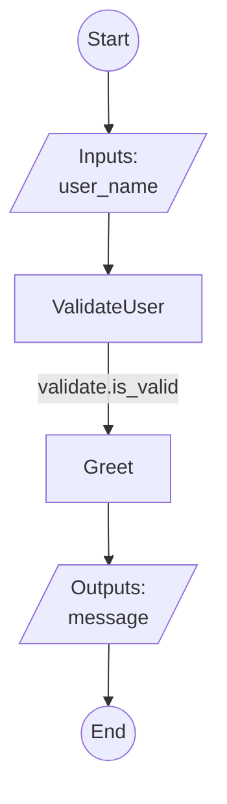

# FlowLang

A workflow orchestration language that helps you design workflows in YAML and deploy them as REST APIs with automatic code generation.

## What is FlowLang?

FlowLang lets you design workflows in simple YAML, then automatically generates complete, production-ready projects with:
- Task implementation stubs
- Unit tests
- REST API server
- Helper scripts
- Complete documentation

You implement tasks one at a time—like TDD for workflows—and always know exactly what's done vs pending. Every flow is immediately deployable as a REST API.

## Key Features

- **Design-first approach**: Write workflows in clean, readable YAML
- **TDD-style development**: Auto-generate task stubs with tests
- **Built-in progress tracking**: Always know what's implemented (3/15, 10/15, etc.)
- **REST API included**: FastAPI server auto-generated for every flow
- **Smart merge**: Update flows without losing implementations
- **Complete project structure**: Get tests, docs, and helper scripts automatically

## Quick Start

### Installation

```bash
# Clone the repository
git clone https://github.com/hello-adam-martin/FlowLang.git
cd FlowLang

# Create virtual environment
python -m venv myenv
source myenv/bin/activate  # On Windows: myenv\Scripts\activate

# Install dependencies
pip install -r requirements.txt

# Install FlowLang in development mode
pip install -e .
```

### Create Your First Flow

1. **Define your workflow in YAML** (e.g., `flows/hello_world.yaml`):

```yaml
flow: HelloWorld
description: A simple greeting workflow

inputs:
  - name: user_name
    type: string
    required: true

steps:
  - task: ValidateUser
    id: validate
    inputs:
      name: ${inputs.user_name}
    outputs:
      - is_valid

  - task: Greet
    id: greet_step
    if: ${validate.is_valid}
    inputs:
      name: ${inputs.user_name}
    outputs:
      - greeting

outputs:
  - name: message
    value: ${greet_step.greeting}
```

2. **Generate complete project structure** (RECOMMENDED):

```bash
# Convention-based: creates flows/HelloWorld/ from flows/hello_world.yaml
# Note: Directory names are automatically converted to PascalCase
python -m flowlang.scaffolder auto flows/hello_world.yaml
```

This creates:
```
flows/
├── hello_world.yaml    # Your source template (edit this)
└── HelloWorld/         # Auto-generated project (PascalCase)
    ├── flow.yaml       # Copy of source (used by server)
    ├── flow.py         # Task stubs to implement
    ├── api.py          # FastAPI server
    ├── README.md       # Complete documentation
    ├── tools/
    │   └── start_server.sh # Server launcher
    └── tests/
        └── test_tasks.py   # Unit tests
```

**Naming Convention**: Flow directories are automatically named in PascalCase:
- `test.yaml` → `Test/`
- `user_auth.yaml` → `UserAuth/`
- `my_workflow.yaml` → `MyWorkflow/`

**Alternative (explicit paths)**:
```bash
# If you prefer to specify output directory explicitly
python -m flowlang.scaffolder scaffold my_flow.yaml -o ./my_project
```

3. **Implement your tasks** in `flow.py`:

```python
@registry.register('ValidateUser')
async def validate_user(name):
    is_valid = len(name) > 0
    return {'is_valid': is_valid}

@registry.register('Greet')
async def greet(name):
    greeting = f"Hello, {name}! Welcome to FlowLang."
    return {'greeting': greeting}
```

4. **Start the REST API server**:

```bash
cd my_project
./tools/start_server.sh
```

**Hot Reload is enabled by default!** Edit `flow.py` or `flow.yaml` and your changes will reload automatically without restarting the server.

5. **Test your flow**:

```bash
curl -X POST http://localhost:8000/flows/HelloWorld/execute \
  -H "Content-Type: application/json" \
  -d '{"inputs": {"user_name": "Alice"}}'
```

Visit http://localhost:8000/docs for interactive API documentation.

## Core Features

### Flow Templates

Jumpstart your workflow development with pre-built, production-ready templates:

**Available Templates**:

1. **API Integration Template** - Production-ready REST API client with:
   - Input validation and early termination
   - Authentication handling (API keys, Bearer tokens, OAuth)
   - Smart retry logic with exponential backoff
   - Comprehensive error handling (retryable vs non-retryable)
   - Response parsing and transformation
   - Logging for monitoring and debugging
   - Timeout support
   - **100% implemented** - ready to customize and deploy

**Create from template (Interactive - Recommended)**:
```bash
# Interactive mode with smart defaults
./scripts/create_flow_from_template.sh

# You'll be prompted for:
# - Template name (default: APIIntegration)
# - Flow name (e.g., GitHubAPI)
# - Template variables with sensible defaults
```

**Create from template (Direct)**:
```bash
# List available templates
python -m flowlang template list

# Create a GitHub API integration
python -m flowlang template create APIIntegration flows/GitHubAPI \
  --var FLOW_NAME=GitHubAPI \
  --var "FLOW_DESCRIPTION=Integrate with GitHub REST API" \
  --var API_BASE_URL=https://api.github.com \
  --var API_KEY_ENV_VAR=GITHUB_TOKEN \
  --var AUTH_HEADER_NAME=Authorization \
  --var "AUTH_HEADER_PREFIX=Bearer "

# Then generate complete project structure
python -m flowlang scaffolder update flows/GitHubAPI/flow.yaml -o flows/GitHubAPI
```

**Check required variables for a template**:
```bash
python -m flowlang template vars APIIntegration
```

**After creating from template**:
```bash
cd flows/GitHubAPI
python flow.py                     # Check status (shows 10/10 implemented!)
./tools/start_server.sh --reload   # Start API server

# Test it
curl -X POST http://localhost:8000/flows/GitHubAPI/execute \
  -H "Content-Type: application/json" \
  -d '{"inputs": {"endpoint": "/repos/octocat/Hello-World", "method": "GET"}}'
```

**What you get**:
- Complete flow.yaml with best practices and your custom variables
- **Fully implemented tasks** (10/10 - 100% ready!)
- FastAPI server (api.py)
- Comprehensive README with examples
- Unit tests (tests/test_tasks.py)
- Helper scripts (tools/start_server.sh)
- Complete project structure

The interactive script (`./scripts/create_flow_from_template.sh`) automatically:
1. Creates flow from template with your variables
2. Runs scaffolder to generate complete project structure
3. Preserves all template implementations (smart merge)
4. Results in a **production-ready** flow project

See `templates/APIIntegration/README.md` for detailed documentation on the API Integration template, including customization examples and common patterns.

### Flow Constructs

FlowLang supports:

- **Sequential execution**: Steps run one after another
- **Parallel execution**: Run multiple steps concurrently
- **Conditionals**: `if/then/else` logic, quantified conditions (`any/all/none`), and `switch/case` multi-way branching
- **Loops**: `for_each` over collections
- **Early termination**: `exit` step for explicit flow termination
- **Error handling**: Retries and fallback logic
- **Variable resolution**: `${inputs.var}`, `${step.output}`

### Smart Scaffolder

The scaffolder is intelligent:

- **First time**: Creates complete project structure
- **Updates**: Preserves your implementations, adds new tasks
- **Smart merge**: Never overwrites working code
- **Progress tracking**: Shows 5/15 tasks implemented, 10 pending
- **Convention-based**: `auto` command infers output directory from YAML path
- **Smart naming**: Automatically converts filenames to PascalCase directories
- **Batch processing**: `auto-all` processes multiple flows at once

**Convention-based workflow (RECOMMENDED)**:
```bash
# Create source template
flows/my_flow.yaml

# Auto-generate project (creates flows/MyFlow/ in PascalCase)
python -m flowlang.scaffolder auto flows/my_flow.yaml

# Or batch process multiple flows
python -m flowlang.scaffolder auto-all flows/
```

**Benefits**:
- Source YAML (`flows/my_flow.yaml`) is your master template
- Generated project (`flows/MyFlow/`) contains copy + implementations (auto-converted to PascalCase)
- Clear separation between source and generated code
- Easy to version control (commit YAMLs, gitignore generated projects if desired)
- Works seamlessly with multi-flow server

### REST API Server

Every flow gets a production-ready REST API:

- **Auto-generated endpoints**: Execute flows, check status, list tasks
- **OpenAPI/Swagger docs**: Interactive API documentation
- **Type validation**: Pydantic models from flow definition
- **Error handling**: Proper HTTP status codes and error messages
- **Hot reload**: Changes reload automatically without server restart (enabled by default)

### Multi-Flow Support

Serve multiple flows from a single API server:

- **Single endpoint**: One server process for all your workflows
- **Auto-discovery**: Automatically detects flows in subdirectories
- **Aggregate health**: Monitor readiness of all flows at once
- **Per-flow isolation**: Each flow has its own executor and task registry

**Directory structure** (YAML-first pattern):
```
flows/
├── hello_world.yaml    # Source template (edit this)
├── HelloWorld/         # Auto-generated project (PascalCase)
│   ├── flow.yaml       # Copy of source (used by server)
│   └── flow.py         # Task implementations
├── user_profile.yaml   # Source template (edit this)
├── UserProfile/        # Auto-generated project (PascalCase)
│   ├── flow.yaml       # Copy of source (used by server)
│   └── flow.py         # Task implementations
└── ...
```

**Create multiple flows**:
```bash
# Batch process all YAML files in flows/
python -m flowlang.scaffolder auto-all flows/
```

**Start multi-flow server**:
```bash
# Option 1: Using convenience script
./scripts/start_multi_server.sh

# Option 2: Direct Python command
python -m flowlang.server --multi flows

# With custom port
./scripts/start_multi_server.sh --port 8080

# With auto-reload
./scripts/start_multi_server.sh --reload
```

**Key API endpoints**:
- `/` - API overview with all available endpoints and flow status
- `/health` - Shows aggregate status for all flows
- `/flows` - List all flows with schemas
- `/flows/{flow_name}` - Get specific flow information
- `/flows/{flow_name}/execute` - Execute specific flow
- `/flows/{flow_name}/execute/stream` - Execute with real-time event streaming
- `/flows/{flow_name}/tasks` - List tasks and implementation status
- `/flows/{flow_name}/visualize` - Get Mermaid diagram of flow
- `/docs` - Interactive OpenAPI/Swagger documentation

### VS Code Integration

Enhanced development experience with autocompletion, validation, and snippets:

- **Autocompletion**: Type-aware suggestions for all FlowLang constructs
- **Real-time validation**: Catches errors as you type
- **Code snippets**: Quick templates (`flow`, `task`, `parallel`, `conditional`, etc.)
- **Hover docs**: Documentation on hover
- **Format on save**: Automatic YAML formatting

**Setup** (one-time):
1. Install [YAML extension by Red Hat](https://marketplace.visualstudio.com/items?itemName=redhat.vscode-yaml)
2. Reload VS Code - schema and snippets activate automatically for all `flow.yaml` files

**Quick start:**
- Type `flow` + Tab → Complete flow template
- Type `task` + Tab → Task step template
- Type `${` → Variable suggestions

See [.vscode/README.md](.vscode/README.md) for complete documentation and all available snippets.

### Flow Visualization

Automatically generate visual diagrams of your flows:

- **Mermaid diagrams**: Visual flowcharts showing flow structure
- **CLI tool**: Generate diagrams from command line
- **API endpoint**: Get diagrams via REST API
- **Auto-generated**: Included in scaffolded project READMEs

**Generate diagram from CLI**:
```bash
python -m flowlang.visualizer flow.yaml
```

**Save to file**:
```bash
python -m flowlang.visualizer flow.yaml -o diagram.md
```

**Get diagram from API**:
```bash
curl http://localhost:8000/flows/HelloWorld/visualize
```

**Example diagram** (rendered in GitHub/editors that support Mermaid):



Diagrams show:
- Flow inputs and outputs
- Task execution steps
- Parallel execution paths
- Conditional branching
- Loops and iterations

## Project Structure

```
FlowLang/
├── src/flowlang/           # Core library
│   ├── executor.py         # Flow execution engine
│   ├── registry.py         # Task registration
│   ├── context.py          # Execution context
│   ├── server.py           # REST API server
│   ├── scaffolder.py       # Code generator
│   ├── templates.py        # Template management system
│   └── exceptions.py       # Custom exceptions
├── templates/              # Pre-built flow templates
│   └── APIIntegration/     # REST API integration template
│       ├── flow.yaml       # Template flow definition
│       ├── flow.py         # Template task implementations
│       └── README.md       # Template documentation
├── flows/                  # Flow definitions and examples
│   ├── hello_world.yaml        # Source YAML template
│   ├── HelloWorld/             # Working example project
│   ├── loan_approval_v2.yaml   # Pattern example: complex approval flow
│   ├── exit_example.yaml       # Pattern example: exit step usage
│   └── early_termination_pattern.yaml  # Pattern example: control flow
├── CLAUDE.md               # Development guide
└── README.md               # This file
```

## Example: HelloWorld Flow

Check out `flows/HelloWorld/` for a complete working example with:
- Input validation
- Conditional logic (if/then/else)
- Multiple task types
- Error handling patterns
- Full REST API server
- 100% test coverage

Start it with:
```bash
cd flows/HelloWorld
./tools/start_server.sh
```

Then test it:
```bash
# Valid request
curl -X POST http://localhost:8000/flows/HelloWorld/execute \
  -H "Content-Type: application/json" \
  -d '{"inputs": {"user_name": "Alice"}}'

# Invalid request (empty name)
curl -X POST http://localhost:8000/flows/HelloWorld/execute \
  -H "Content-Type: application/json" \
  -d '{"inputs": {"user_name": ""}}'
```

## Development Workflow

### Creating a Flow (YAML-first pattern)

1. **Create source YAML**: `flows/my_flow.yaml`
2. **Auto-generate project**: `python -m flowlang.scaffolder auto flows/my_flow.yaml`
3. **Implement tasks**: Edit `flows/MyFlow/flow.py` (note: PascalCase directory)
4. **Run tests**: `pytest flows/MyFlow/tests/`
5. **Update status**: Mark tasks as implemented in `get_implementation_status()`
6. **Start server**: `cd flows/MyFlow && ./tools/start_server.sh`

### Updating a Flow

When you change your flow definition:

**Option 1: Re-run auto command** (RECOMMENDED)
```bash
# Edit flows/my_flow.yaml (your source template)
# Then re-run auto to update the generated project
python -m flowlang.scaffolder auto flows/my_flow.yaml
```

**Option 2: Batch regenerate all flows**
```bash
# From project root - processes all flows in flows/
./scripts/generate_flows.sh
```

Both methods intelligently:
- Preserve all implemented tasks
- Add new tasks as stubs
- Update tests
- Regenerate documentation

## API Usage

### Client SDKs

FlowLang provides official client SDKs for Python and TypeScript/JavaScript.

#### Python Client SDK

Type-safe Python client for calling flows programmatically:

```python
from flowlang import FlowLangClient

# Async usage (recommended)
async with FlowLangClient("http://localhost:8000") as client:
    result = await client.execute_flow("HelloWorld", {"user_name": "Alice"})
    print(result.outputs["message"])

# Sync usage
with FlowLangClient("http://localhost:8000") as client:
    result = client.execute_flow_sync("HelloWorld", {"user_name": "Alice"})
    print(result.outputs["message"])

# Streaming execution with events
async with FlowLangClient("http://localhost:8000") as client:
    def handle_event(event_type, data):
        if event_type == 'step_completed':
            print(f"Completed: {data['step_id']}")

    result = await client.execute_flow_stream(
        "HelloWorld",
        {"user_name": "Alice"},
        on_event=handle_event
    )
```

**Features**:
- Type-safe flow execution (async and sync)
- Automatic retry with exponential backoff
- Streaming support for long-running flows
- Comprehensive error handling
- Health checks and flow introspection
- Context manager support for automatic cleanup

**Installation**: The client requires `httpx` (already in requirements.txt)

See [docs/client-sdk.md](docs/client-sdk.md) for complete documentation and [examples/client_usage.py](examples/client_usage.py) for detailed examples.

#### TypeScript/JavaScript Client SDK

Modern TypeScript client for Node.js and browsers:

```typescript
import { FlowLangClient } from '@flowlang/client';

const client = new FlowLangClient({
  baseUrl: 'http://localhost:8000',
});

// Execute a flow (with type safety!)
const result = await client.executeFlow<{ message: string }>(
  'HelloWorld',
  { user_name: 'Alice' }
);
console.log(result.outputs.message);

// Streaming execution
await client.executeFlowStream('HelloWorld', { user_name: 'Alice' }, {
  onEvent: (eventType, data) => {
    if (eventType === 'step_completed') {
      console.log(`Completed: ${data.step_id}`);
    }
  }
});
```

**Features**:
- Full TypeScript support with generics
- Promise-based API (async/await)
- Automatic retry with exponential backoff
- Streaming events (Server-Sent Events)
- Works in browser and Node.js
- Zero dependencies (uses native fetch)
- Tree-shakeable for minimal bundle size

**Installation**:
```bash
npm install @flowlang/client
```

See [clients/typescript/README.md](clients/typescript/README.md) for complete documentation and [clients/typescript/examples/](clients/typescript/examples/) for detailed examples.

### API Root / Endpoints Overview

Get an overview of the API and all available endpoints:

**Single flow mode**:
```bash
curl http://localhost:8000/
```

Returns:
```json
{
  "service": "FlowLang API Server",
  "version": "1.0.0",
  "flow": {
    "name": "HelloWorld",
    "description": "A simple greeting workflow",
    "ready": true,
    "progress": "2/2",
    "percentage": "100.0%"
  },
  "status": "ready",
  "documentation": {
    "openapi": "/docs",
    "redoc": "/redoc",
    "openapi_json": "/openapi.json"
  },
  "endpoints": {
    "info": {
      "root": "/",
      "health": "/health"
    },
    "flows": {
      "list": "/flows",
      "info": "/flows/HelloWorld",
      "tasks": "/flows/HelloWorld/tasks",
      "visualize": "/flows/HelloWorld/visualize"
    },
    "execution": {
      "execute": "/flows/HelloWorld/execute",
      "stream": "/flows/HelloWorld/execute/stream"
    }
  }
}
```

**Multi-flow mode**:
```bash
curl http://localhost:8000/
```

Returns:
```json
{
  "service": "FlowLang Multi-Flow API Server",
  "version": "1.0.0",
  "status": "ready",
  "flows": {
    "count": 2,
    "names": ["HelloWorld", "UserProfile"],
    "status": {
      "HelloWorld": {
        "ready": true,
        "progress": "3/3",
        "percentage": "100.0%"
      },
      "UserProfile": {
        "ready": true,
        "progress": "5/5",
        "percentage": "100.0%"
      }
    }
  },
  "documentation": {
    "openapi": "/docs",
    "redoc": "/redoc",
    "openapi_json": "/openapi.json"
  },
  "endpoints": {
    "info": {
      "root": "/",
      "health": "/health"
    },
    "flows": {
      "list": "/flows",
      "info": "/flows/{flow_name}",
      "tasks": "/flows/{flow_name}/tasks",
      "visualize": "/flows/{flow_name}/visualize"
    },
    "execution": {
      "execute": "/flows/{flow_name}/execute",
      "stream": "/flows/{flow_name}/execute/stream"
    }
  }
}
```

### Execute a Flow

```bash
curl -X POST http://localhost:8000/flows/HelloWorld/execute \
  -H "Content-Type: application/json" \
  -d '{
    "inputs": {
      "user_name": "Alice"
    }
  }'
```

### Response

```json
{
  "success": true,
  "outputs": {
    "message": "Hello, Alice! Welcome to FlowLang."
  },
  "execution_time_ms": 12.5,
  "flow": "HelloWorld"
}
```

### Check Health and Readiness

**Single flow mode**:
```bash
curl http://localhost:8000/health
```

Returns:
```json
{
  "status": "healthy",
  "flow": "HelloWorld",
  "tasks_implemented": 2,
  "tasks_total": 2,
  "tasks_pending": 0,
  "implementation_complete": true,
  "ready": true,
  "pending_task_names": []
}
```

**Multi-flow mode**:
```bash
curl http://localhost:8000/health
```

Returns aggregate status:
```json
{
  "status": "healthy",
  "server_type": "multi-flow",
  "flows_count": 2,
  "all_flows_ready": false,
  "aggregate_tasks": {
    "total": 7,
    "implemented": 5,
    "pending": 2,
    "progress": "5/7"
  },
  "flows": [
    {
      "name": "HelloWorld",
      "ready": true,
      "tasks_implemented": 3,
      "tasks_total": 3,
      "tasks_pending": 0,
      "progress": "3/3",
      "pending_task_names": []
    },
    {
      "name": "UserProfile",
      "ready": false,
      "tasks_implemented": 3,
      "tasks_total": 5,
      "tasks_pending": 2,
      "progress": "3/5",
      "pending_task_names": ["UpdateProfile", "DeleteProfile"]
    }
  ]
}
```

**Note**: `ready` is `true` only when ALL tasks are implemented. The API returns HTTP 503 if you try to execute a flow with unimplemented tasks. In multi-flow mode, `all_flows_ready` is true only when ALL flows are ready.

### Check Task Status

```bash
curl http://localhost:8000/flows/HelloWorld/tasks
```

Returns implementation progress and task list.

## Advanced Features

### Hot Reload & Live Development

FlowLang includes powerful hot reload capabilities for rapid development:

**Server Hot Reload** (enabled by default in generated `api.py`):
- Automatically reloads `flow.py` when task implementations change
- Automatically reloads `flow.yaml` when flow definitions change
- No server restart required
- Preserves server state and connections
- Rolls back to previous version on errors
- Works in both single-flow and multi-flow modes

```bash
# Single flow - hot reload enabled by default
cd flows/HelloWorld
uvicorn api:app --host 0.0.0.0 --port 8000

# Multi-flow with hot reload
./scripts/start_multi_server.sh --reload
```

**Watch Mode** for interactive development:
```bash
# From a flow project directory
cd flows/HelloWorld
python -m flowlang watch --test-inputs test_inputs.json
```

Watch mode features:
- Auto-executes flow when files change
- Color-coded terminal output (green=success, red=error)
- Performance metrics (execution time)
- Output diff comparison between runs
- Perfect for TDD-style development

Create `test_inputs.json`:
```json
{
  "user_name": "TestUser"
}
```

Then edit `flow.py` or `flow.yaml` and see results instantly!

### Variable Resolution

```yaml
steps:
  - task: GetUser
    id: user_step
    outputs:
      - user_data

  - task: SendEmail
    inputs:
      email: ${user_step.user_data.email}
      name: ${user_step.user_data.name}
```

### Parallel Execution

```yaml
steps:
  - parallel:
      - task: FetchUserData
        id: user
      - task: FetchOrders
        id: orders
      - task: FetchPreferences
        id: prefs
```

### Conditional Logic (If/Then/Else)

Basic conditionals:

```yaml
steps:
  - task: CheckAge
    id: age_check
    outputs:
      - age

  - if: ${age_check.age} >= 18
    then:
      - task: GrantFullAccess
    else:
      - task: GrantLimitedAccess
```

### Quantified Conditionals (ANY/ALL/NONE)

For complex conditional logic with multiple conditions:

**ANY** - True if at least one condition is true:

```yaml
steps:
  - if:
      any:
        - ${user.role} == "admin"
        - ${user.role} == "moderator"
        - ${resource.owner} == ${user.id}
    then:
      - task: GrantEditAccess
```

**ALL** - True if all conditions are true:

```yaml
steps:
  - if:
      all:
        - ${user.verified} == true
        - ${user.age} >= 18
        - ${user.country} == "US"
    then:
      - task: AllowRegistration
```

**NONE** - True if no conditions are true:

```yaml
steps:
  - if:
      none:
        - ${user.banned} == true
        - ${user.suspended} == true
        - ${resource.locked} == true
    then:
      - task: AllowAccess
```

**Nested quantifiers** - Combine quantifiers for complex logic:

```yaml
steps:
  # User can access if verified AND (admin OR owner)
  - if:
      all:
        - ${user.verified} == true
        - any:
            - ${user.role} == "admin"
            - ${resource.owner} == ${user.id}
    then:
      - task: GrantAccess
```

### Multi-Way Branching (Switch/Case)

For cleaner multi-way branching compared to nested if/else:

```yaml
steps:
  - task: GetUserStatus
    id: status_check
    outputs:
      - status

  - switch: ${status_check.status}
    cases:
      - when: "new"
        do:
          - task: SendWelcomeEmail
          - task: CreateOnboardingTask

      - when: "active"
        do:
          - task: SendRegularUpdate
          - task: CheckSubscription

      - when: "suspended"
        do:
          - task: SendReactivationOffer
          - task: LogSuspension

      - when: ["pending", "trial"]  # Multiple values
        do:
          - task: SendTrialReminder

      - default:
          - task: LogUnknownStatus
          - task: SendAdminAlert
```

### Error Handling

```yaml
steps:
  - task: RiskyOperation
    retry:
      max_attempts: 3
      delay_seconds: 1
    on_error:
      - task: LogError
      - task: SendAlert
```

### Early Termination with Exit

Use the `exit` step to explicitly terminate flow execution early. This is useful for guard clauses and validation patterns:

**Simple exit**:
```yaml
steps:
  - task: ValidateInput
    id: validation
    outputs:
      - is_valid

  - if: ${validation.is_valid} == false
    then:
      - exit
```

**Exit with reason**:
```yaml
steps:
  - task: FetchUser
    id: user
    outputs:
      - found

  - if: ${user.found} == false
    then:
      - exit:
          reason: "User not found"
```

**Exit with outputs**:
```yaml
steps:
  - task: CheckPermissions
    id: perms
    outputs:
      - allowed

  - if: ${perms.allowed} == false
    then:
      - exit:
          reason: "Permission denied"
          outputs:
            status: "error"
            error_code: "PERMISSION_DENIED"
```

**Guard clause pattern**:
```yaml
steps:
  # Multiple guard clauses exit early if validation fails
  - task: FetchUser
    id: user
    outputs:
      - found
      - active

  - if: ${user.found} == false
    then:
      - exit:
          reason: "User not found"
          outputs:
            status: "error"

  - if: ${user.active} == false
    then:
      - exit:
          reason: "User inactive"
          outputs:
            status: "inactive"

  # Continue processing - only runs if all guards passed
  - task: ProcessUser
    id: result
```

**When flow is terminated via `exit`**:
- Execution stops immediately
- Flow returns `success: true` and `terminated: true`
- Reason and outputs from exit step are included in response
- Any flow outputs defined in YAML are NOT returned (use exit outputs instead)

See `flows/exit_example.yaml` for more examples and [`docs/control-flow-patterns.md`](docs/control-flow-patterns.md) for best practices.

## Testing

Run tests for a flow project:

```bash
cd my_project
pytest tests/test_tasks.py -v
```

Check implementation progress:

```bash
python flow.py
```

## Contributing

Contributions are welcome! This project is in active development.

## Documentation

For detailed development guidelines, see [CLAUDE.md](./CLAUDE.md).

## Project Status

✅ **Implemented**:
- Core flow executor with async support
- YAML-based flow definitions
- Sequential, parallel, conditional, and loop execution
- Variable resolution and context management
- Task registry with progress tracking
- Smart scaffolder with merge capabilities and PascalCase naming
- REST API server with FastAPI (single and multi-flow modes)
- **Hot reload for rapid development** (file watching, selective reload, rollback on errors)
- **Watch mode for live testing** (auto-execution, color-coded output, performance metrics)
- **Flow templates system** (pre-built production-ready templates with variable substitution)
  - API Integration template (REST API client with auth, retry, error handling)
- **Python Client SDK** (type-safe API client with async/sync support, streaming, retry logic)
- **TypeScript Client SDK** (modern Promise-based client for Node.js and browsers)
- Auto-generated project structure
- Complete documentation generation
- Multi-flow support with auto-discovery
- VS Code integration (autocompletion, validation, snippets)
- Flow visualization (Mermaid diagrams, CLI, API)

🚧 **In Progress**:
- Additional templates (ETL Pipeline, Approval Workflow, Notification Flow)
- Advanced error handling patterns
- Flow composition and subflows

🎯 **Planned**:
- Template gallery with community templates
- Web UI for flow design
- Monitoring and observability
- Event-driven triggers
- Cloud deployment templates

## License

MIT License
