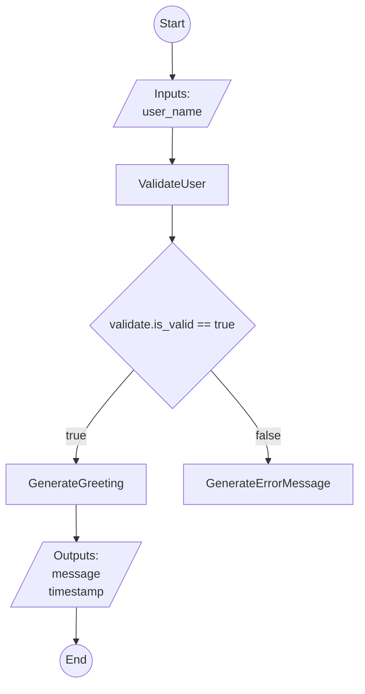

# FlowLang Hello World Tutorial

Welcome to FlowLang! This comprehensive tutorial will guide you through everything you need to know to build, test, deploy, and use workflows with FlowLang.

**What you'll learn:**
- Creating flows with YAML
- Implementing tasks in Python
- Testing your workflows
- Deploying as REST APIs
- Calling flows from client applications
- Advanced flow patterns and best practices

**Time required:** ~2.5 hours

**Prerequisites:**
- Python 3.8 or higher
- Basic understanding of YAML and Python
- Terminal/command line familiarity

---

## Table of Contents

1. [Getting Started](#part-1-getting-started)
2. [Creating Your First Flow](#part-2-creating-your-first-flow)
3. [Implementing Tasks](#part-3-implementing-tasks)
4. [Testing Your Flow](#part-4-testing-your-flow)
5. [Running the API Server](#part-5-running-the-api-server)
6. [Calling from Client Code](#part-6-calling-from-client-code)
7. [Flow Visualization](#part-7-flow-visualization)
8. [Advanced Features](#part-8-advanced-features)
9. [Multi-Flow Setup](#part-9-multi-flow-setup)
10. [Deployment & Best Practices](#part-10-deployment--best-practices)

---

## Part 1: Getting Started

**Time: 15 minutes**

### Installation

First, let's install FlowLang:

```bash
# Clone the repository
git clone https://github.com/hello-adam-martin/FlowLang.git
cd FlowLang

# Create and activate virtual environment
python -m venv myenv
source myenv/bin/activate  # On Windows: myenv\Scripts\activate

# Install dependencies
pip install -r requirements.txt

# Install FlowLang in development mode
pip install -e .
```

### Verify Installation

Use the `flowlang doctor` command to verify your environment:

```bash
flowlang doctor
```

You should see:

```
🩺 FlowLang Environment Check

✅ Python Version
✅ FlowLang Installation
✅ Virtual Environment
✅ Git
✅ Templates
✅ Package: pyyaml
✅ Package: fastapi
✅ Package: uvicorn
✅ Package: pydantic

📊 Summary: 9/9 checks passed
   All checks passed! 🎉
```

If any checks fail, use `flowlang doctor --fix` to automatically install missing dependencies.

### Understanding the Project Structure

FlowLang organizes code into several key directories:

```
FlowLang/
├── src/flowlang/          # Core library (executor, server, scaffolder)
├── flows/                 # Your workflow projects live here
├── templates/             # Pre-built flow templates
├── docs/                  # Documentation
└── examples/              # Example code
```

When you create a flow project, it will have this structure:

```
my_flow_project/
├── flow.yaml              # Flow definition (what to do)
├── flow.py                # Task implementations (how to do it)
├── api.py                 # REST API server
├── README.md              # Project documentation
├── tools/
│   ├── start_server.sh    # Server launcher
│   └── generate.sh        # Project generator
└── tests/
    └── test_tasks.py      # Unit tests
```

---

## Part 2: Creating Your First Flow

**Time: 20 minutes**

### Option 1: Using the Interactive Wizard (Recommended)

The easiest way to create a new flow is with the interactive wizard:

```bash
flowlang init hello-world
```

This will guide you through:
1. **Template selection**: Choose "Skip" to start from scratch
2. **Flow name**: Enter "HelloWorld"
3. **Description**: Enter "A simple greeting workflow"
4. **Git initialization**: Press Enter to accept (yes)

### Option 2: Manual Creation

If you prefer more control, create the flow manually:

```bash
# Create project directory
mkdir -p flows/hello-world
cd flows/hello-world
```

Now create `flow.yaml`:

```yaml
flow: HelloWorld
description: A simple greeting workflow demonstrating basic FlowLang features

inputs:
  - name: user_name
    type: string
    required: true
    description: Name of the user to greet

steps:
  # Step 1: Validate the user name
  - task: ValidateUser
    id: validate
    inputs:
      name: ${inputs.user_name}
    outputs:
      - is_valid
      - validation_message

  # Step 2: Greet the user (only if valid)
  - if: ${validate.is_valid} == true
    then:
      - task: GenerateGreeting
        id: greet
        inputs:
          name: ${inputs.user_name}
        outputs:
          - greeting
          - timestamp
    else:
      - task: GenerateErrorMessage
        id: error
        inputs:
          reason: ${validate.validation_message}
        outputs:
          - error_message

outputs:
  - name: message
    value: ${greet.greeting}
    description: The greeting message (if validation passed)

  - name: timestamp
    value: ${greet.timestamp}
    description: When the greeting was generated
```

### Understanding the Flow Definition

Let's break down each section:

**1. Flow Metadata:**
```yaml
flow: HelloWorld
description: A simple greeting workflow...
```
- `flow`: The name of your workflow (used in API endpoints)
- `description`: Human-readable description

**2. Inputs:**
```yaml
inputs:
  - name: user_name
    type: string
    required: true
    description: Name of the user to greet
```
- Defines what data the flow needs to execute
- `name`: Variable name (accessed as `${inputs.user_name}`)
- `type`: Data type (string, number, boolean, object, array)
- `required`: Whether the input is mandatory
- `description`: Documentation for API users

**3. Steps:**
```yaml
steps:
  - task: ValidateUser
    id: validate
    inputs:
      name: ${inputs.user_name}
    outputs:
      - is_valid
      - validation_message
```
- `task`: Name of the task to execute
- `id`: Unique identifier for this step (used to reference outputs)
- `inputs`: Data passed to the task (supports variable resolution)
- `outputs`: List of values this task returns

**4. Conditional Logic:**
```yaml
  - if: ${validate.is_valid} == true
    then:
      - task: GenerateGreeting
    else:
      - task: GenerateErrorMessage
```
- Execute different steps based on conditions
- Supports comparison operators: `==`, `!=`, `<`, `>`, `<=`, `>=`
- Can reference step outputs: `${step_id.output_name}`

**5. Outputs:**
```yaml
outputs:
  - name: message
    value: ${greet.greeting}
    description: The greeting message
```
- Defines what the flow returns
- Values come from step outputs
- Returned in API response

### Generate Project Structure

Now use the scaffolder to generate the complete project:

```bash
# From the FlowLang root directory
python -m flowlang.scaffolder scaffold flows/hello-world/flow.yaml -o flows/hello-world
```

This creates:
- `flow.py` - Task implementation stubs
- `api.py` - REST API server
- `tests/test_tasks.py` - Unit tests
- `tools/start_server.sh` - Server launcher
- `README.md` - Project documentation

---

## Part 3: Implementing Tasks

**Time: 20 minutes**

Now let's implement the three tasks defined in our flow. Open `flows/hello-world/flow.py`:

### Understanding the Task Registry

At the top of `flow.py`, you'll see:

```python
from flowlang import TaskRegistry

def create_task_registry() -> TaskRegistry:
    """
    Create and configure the task registry for this flow.

    Register your task implementations here using the @registry.register decorator.
    """
    registry = TaskRegistry()

    # Tasks will be registered here

    return registry
```

This function creates a registry where you register task implementations. The scaffolder generates stub implementations for each task.

### Task 1: ValidateUser

Replace the stub with this implementation:

```python
    @registry.register('ValidateUser',
                      description='Validate user name is not empty and meets requirements')
    async def validate_user(name: str):
        """
        Validate the user name.

        Args:
            name: The user name to validate

        Returns:
            dict with:
                - is_valid: True if name is valid, False otherwise
                - validation_message: Message explaining validation result
        """
        # Remove whitespace
        name = name.strip()

        # Check if name is empty
        if not name:
            return {
                'is_valid': False,
                'validation_message': 'Name cannot be empty'
            }

        # Check minimum length
        if len(name) < 2:
            return {
                'is_valid': False,
                'validation_message': 'Name must be at least 2 characters'
            }

        # Check maximum length
        if len(name) > 50:
            return {
                'is_valid': False,
                'validation_message': 'Name must be less than 50 characters'
            }

        # All checks passed
        return {
            'is_valid': True,
            'validation_message': 'Name is valid'
        }
```

**Key points:**
- Use `@registry.register` decorator with task name matching flow.yaml
- All tasks are `async def` functions
- Return a dictionary with keys matching the `outputs` in flow.yaml
- Add type hints for better documentation

### Task 2: GenerateGreeting

```python
    @registry.register('GenerateGreeting',
                      description='Generate a personalized greeting message')
    async def generate_greeting(name: str):
        """
        Generate a greeting for the user.

        Args:
            name: The user's name

        Returns:
            dict with:
                - greeting: The personalized greeting message
                - timestamp: ISO 8601 timestamp of when greeting was generated
        """
        from datetime import datetime

        # Create personalized greeting
        greeting = f"Hello, {name}! Welcome to FlowLang. 🎉"

        # Get current timestamp in ISO format
        timestamp = datetime.utcnow().isoformat() + 'Z'

        return {
            'greeting': greeting,
            'timestamp': timestamp
        }
```

### Task 3: GenerateErrorMessage

```python
    @registry.register('GenerateErrorMessage',
                      description='Generate an error message for invalid input')
    async def generate_error_message(reason: str):
        """
        Generate an error message.

        Args:
            reason: The reason validation failed

        Returns:
            dict with:
                - error_message: A formatted error message
        """
        error_message = f"❌ Sorry, I can't greet you: {reason}"

        return {
            'error_message': error_message
        }
```

### Checking Implementation Progress

After implementing all tasks, you can check the status:

```bash
cd flows/hello-world
python flow.py
```

You should see:

```
✅ All tasks implemented (3/3)

Task Implementation Status:
✅ ValidateUser - Validate user name is not empty and meets requirements
✅ GenerateGreeting - Generate a personalized greeting message
✅ GenerateErrorMessage - Generate an error message for invalid input

Flow is ready to execute!
```

---

## Part 4: Testing Your Flow

**Time: 15 minutes**

Testing is crucial for reliable workflows. FlowLang projects include auto-generated tests.

### Understanding the Test Structure

Open `flows/hello-world/tests/test_tasks.py`:

```python
import pytest
from flow import create_task_registry

@pytest.fixture
def registry():
    """Create a task registry for testing."""
    return create_task_registry()


class TestValidateUser:
    """Tests for ValidateUser task"""

    @pytest.mark.asyncio
    async def test_valid_name(self, registry):
        task = registry.get_task('ValidateUser')
        result = await task(name="Alice")

        assert result['is_valid'] is True
        assert result['validation_message'] == 'Name is valid'

    @pytest.mark.asyncio
    async def test_empty_name(self, registry):
        task = registry.get_task('ValidateUser')
        result = await task(name="")

        assert result['is_valid'] is False
        assert 'empty' in result['validation_message'].lower()

    @pytest.mark.asyncio
    async def test_short_name(self, registry):
        task = registry.get_task('ValidateUser')
        result = await task(name="A")

        assert result['is_valid'] is False
        assert '2 characters' in result['validation_message']

    @pytest.mark.asyncio
    async def test_long_name(self, registry):
        task = registry.get_task('ValidateUser')
        result = await task(name="A" * 51)

        assert result['is_valid'] is False
        assert '50 characters' in result['validation_message']


class TestGenerateGreeting:
    """Tests for GenerateGreeting task"""

    @pytest.mark.asyncio
    async def test_greeting_format(self, registry):
        task = registry.get_task('GenerateGreeting')
        result = await task(name="Alice")

        assert 'Alice' in result['greeting']
        assert 'FlowLang' in result['greeting']
        assert 'timestamp' in result
        assert result['timestamp'].endswith('Z')  # ISO 8601 format


class TestGenerateErrorMessage:
    """Tests for GenerateErrorMessage task"""

    @pytest.mark.asyncio
    async def test_error_message_format(self, registry):
        task = registry.get_task('GenerateErrorMessage')
        result = await task(reason="Name is invalid")

        assert '❌' in result['error_message']
        assert 'Name is invalid' in result['error_message']
```

### Running Tests

```bash
cd flows/hello-world
pytest tests/test_tasks.py -v
```

You should see:

```
tests/test_tasks.py::TestValidateUser::test_valid_name PASSED
tests/test_tasks.py::TestValidateUser::test_empty_name PASSED
tests/test_tasks.py::TestValidateUser::test_short_name PASSED
tests/test_tasks.py::TestValidateUser::test_long_name PASSED
tests/test_tasks.py::TestGenerateGreeting::test_greeting_format PASSED
tests/test_tasks.py::TestGenerateErrorMessage::test_error_message_format PASSED

====== 6 passed in 0.15s ======
```

### Testing the Complete Flow

You can also test the entire flow execution:

```python
# tests/test_flow.py
import pytest
from flowlang import FlowExecutor
from flow import create_task_registry

@pytest.fixture
def executor():
    """Create a flow executor for testing."""
    registry = create_task_registry()
    return FlowExecutor(registry)


@pytest.mark.asyncio
async def test_flow_valid_input(executor):
    """Test flow with valid input"""
    with open('flow.yaml', 'r') as f:
        flow_yaml = f.read()

    result = await executor.execute_flow(
        flow_yaml,
        inputs={'user_name': 'Alice'}
    )

    assert result['success'] is True
    assert 'Alice' in result['outputs']['message']
    assert 'timestamp' in result['outputs']


@pytest.mark.asyncio
async def test_flow_empty_name(executor):
    """Test flow with empty name"""
    with open('flow.yaml', 'r') as f:
        flow_yaml = f.read()

    result = await executor.execute_flow(
        flow_yaml,
        inputs={'user_name': ''}
    )

    # Flow succeeds but takes error path
    assert result['success'] is True
    # Outputs won't have message/timestamp because error path was taken
```

---

## Part 5: Running the API Server

**Time: 15 minutes**

Now let's deploy your flow as a REST API!

### Starting the Server

FlowLang generates a convenient startup script:

```bash
cd flows/hello-world
./tools/start_server.sh
```

You should see:

```
INFO:     Started server process
INFO:     Waiting for application startup.
INFO:     Application startup complete.
INFO:     Uvicorn running on http://0.0.0.0:8000
```

**Hot reload is enabled by default!** Any changes to `flow.py` or `flow.yaml` will automatically reload without restarting the server.

### Exploring the Interactive Documentation

Open your browser to http://localhost:8000/docs

You'll see:
- **Swagger UI** with all API endpoints
- Interactive "Try it out" buttons
- Request/response schemas
- Flow information

### Testing with curl

#### Execute the Flow (Valid Input)

```bash
curl -X POST http://localhost:8000/flows/HelloWorld/execute \
  -H "Content-Type: application/json" \
  -d '{"inputs": {"user_name": "Alice"}}'
```

Response:

```json
{
  "success": true,
  "outputs": {
    "message": "Hello, Alice! Welcome to FlowLang. 🎉",
    "timestamp": "2024-10-12T12:34:56.789Z"
  },
  "execution_time_ms": 2.5,
  "flow": "HelloWorld"
}
```

#### Execute with Invalid Input

```bash
curl -X POST http://localhost:8000/flows/HelloWorld/execute \
  -H "Content-Type: application/json" \
  -d '{"inputs": {"user_name": ""}}'
```

Response:

```json
{
  "success": true,
  "outputs": {},
  "execution_time_ms": 1.2,
  "flow": "HelloWorld",
  "terminated": false
}
```

Note: The flow succeeds but returns empty outputs because the error path doesn't define flow-level outputs.

### Checking Flow Health

```bash
curl http://localhost:8000/health
```

Response:

```json
{
  "status": "healthy",
  "flow": "HelloWorld",
  "tasks_implemented": 3,
  "tasks_total": 3,
  "tasks_pending": 0,
  "implementation_complete": true,
  "ready": true,
  "pending_task_names": []
}
```

### Listing All Flows

```bash
curl http://localhost:8000/flows
```

### Getting Flow Information

```bash
curl http://localhost:8000/flows/HelloWorld
```

Response includes flow definition, inputs, outputs, and implementation status.

### Checking Task Status

```bash
curl http://localhost:8000/flows/HelloWorld/tasks
```

Shows which tasks are implemented and which are pending.

---

## Part 6: Calling from Client Code

**Time: 20 minutes**

FlowLang provides official client SDKs for Python and TypeScript.

### Python Client SDK

#### Async Usage (Recommended)

```python
from flowlang import FlowLangClient

async def main():
    async with FlowLangClient("http://localhost:8000") as client:
        # Execute flow
        result = await client.execute_flow(
            "HelloWorld",
            {"user_name": "Alice"}
        )

        print(f"Success: {result.success}")
        print(f"Message: {result.outputs['message']}")
        print(f"Timestamp: {result.outputs['timestamp']}")
        print(f"Execution time: {result.execution_time_ms}ms")

# Run it
import asyncio
asyncio.run(main())
```

#### Sync Usage

For synchronous code (like Django views):

```python
from flowlang import FlowLangClient

with FlowLangClient("http://localhost:8000") as client:
    result = client.execute_flow_sync("HelloWorld", {"user_name": "Alice"})
    print(result.outputs['message'])
```

#### Error Handling

```python
from flowlang import (
    FlowLangClient,
    FlowExecutionError,
    FlowNotReadyError,
    FlowNotFoundError
)

async with FlowLangClient("http://localhost:8000") as client:
    try:
        result = await client.execute_flow("HelloWorld", {"user_name": "Alice"})
        print(result.outputs)

    except FlowNotFoundError:
        print("Flow doesn't exist")

    except FlowNotReadyError as e:
        print(f"Flow not ready. Pending tasks: {e.pending_tasks}")

    except FlowExecutionError as e:
        print(f"Execution failed: {e.error}")
        print(f"Details: {e.error_details}")
```

#### Streaming Execution

For long-running flows, get real-time progress updates:

```python
async def handle_event(event_type, data):
    if event_type == 'step_started':
        print(f"▶️  Starting: {data['step_id']}")
    elif event_type == 'step_completed':
        print(f"✅ Completed: {data['step_id']}")
    elif event_type == 'flow_completed':
        print(f"🎉 Flow finished in {data['duration_ms']}ms")

async with FlowLangClient("http://localhost:8000") as client:
    result = await client.execute_flow_stream(
        "HelloWorld",
        {"user_name": "Alice"},
        on_event=handle_event
    )
    print(f"Final result: {result.outputs}")
```

### TypeScript/JavaScript Client SDK

#### Installation

```bash
npm install @flowlang/client
```

#### Basic Usage

```typescript
import { FlowLangClient } from '@flowlang/client';

const client = new FlowLangClient({
  baseUrl: 'http://localhost:8000',
});

// Execute flow (with type safety!)
const result = await client.executeFlow<{ message: string; timestamp: string }>(
  'HelloWorld',
  { user_name: 'Alice' }
);

console.log(result.outputs.message);
console.log(`Took ${result.executionTimeMs}ms`);
```

#### Error Handling

```typescript
import { FlowLangClient, FlowExecutionError } from '@flowlang/client';

try {
  const result = await client.executeFlow('HelloWorld', { user_name: 'Alice' });
  console.log(result.outputs.message);
} catch (error) {
  if (error instanceof FlowExecutionError) {
    console.error('Flow failed:', error.error);
  }
}
```

#### Streaming Execution

```typescript
await client.executeFlowStream('HelloWorld', { user_name: 'Alice' }, {
  onEvent: (eventType, data) => {
    if (eventType === 'step_completed') {
      console.log(`✅ ${data.step_id} completed`);
    }
  }
});
```

#### React Integration Example

```tsx
import { useState } from 'react';
import { FlowLangClient } from '@flowlang/client';

function GreetingForm() {
  const [name, setName] = useState('');
  const [result, setResult] = useState(null);
  const [loading, setLoading] = useState(false);

  const client = new FlowLangClient({ baseUrl: 'http://localhost:8000' });

  const handleSubmit = async (e) => {
    e.preventDefault();
    setLoading(true);

    try {
      const result = await client.executeFlow('HelloWorld', { user_name: name });
      setResult(result.outputs);
    } catch (error) {
      console.error(error);
    } finally {
      setLoading(false);
    }
  };

  return (
    <form onSubmit={handleSubmit}>
      <input
        value={name}
        onChange={(e) => setName(e.target.value)}
        placeholder="Enter your name"
      />
      <button type="submit" disabled={loading}>
        {loading ? 'Processing...' : 'Greet Me'}
      </button>

      {result && (
        <div>
          <p>{result.message}</p>
          <small>{result.timestamp}</small>
        </div>
      )}
    </form>
  );
}
```

---

## Part 7: Flow Visualization

**Time: 10 minutes**

FlowLang can automatically generate visual diagrams of your flows using Mermaid.

### Generate Diagram via CLI

```bash
cd flows/hello-world
python -m flowlang.visualizer flow.yaml
```

This outputs Mermaid markdown that renders as:



### Save to File

```bash
python -m flowlang.visualizer flow.yaml -o diagram.md
```

### Get Diagram via API

```bash
curl http://localhost:8000/flows/HelloWorld/visualize
```

### Understanding the Diagram

The diagram shows:
- **Start/End nodes**: Flow entry and exit points
- **Input/Output nodes**: Data flowing in and out
- **Task nodes**: Operations (rectangular boxes)
- **Decision nodes**: Conditionals (diamond shapes)
- **Arrows**: Execution flow and data dependencies

You can view Mermaid diagrams:
- In GitHub (automatic rendering)
- In VS Code (with Markdown Preview Mermaid Support extension)
- On https://mermaid.live (paste the code)

---

## Part 8: Advanced Features

**Time: 25 minutes**

Now let's explore more advanced FlowLang capabilities.

### Parallel Execution

Execute multiple tasks concurrently for better performance:

```yaml
flow: ParallelExample
description: Demonstrate parallel execution

inputs:
  - name: user_id
    type: string
    required: true

steps:
  # These three tasks run in parallel
  - parallel:
      - task: FetchUserProfile
        id: profile
        inputs:
          user_id: ${inputs.user_id}
        outputs:
          - user_data

      - task: FetchUserOrders
        id: orders
        inputs:
          user_id: ${inputs.user_id}
        outputs:
          - order_list

      - task: FetchUserPreferences
        id: prefs
        inputs:
          user_id: ${inputs.user_id}
        outputs:
          - preferences

  # This runs after all parallel tasks complete
  - task: CombineResults
    id: combined
    inputs:
      profile: ${profile.user_data}
      orders: ${orders.order_list}
      preferences: ${prefs.preferences}
    outputs:
      - complete_profile

outputs:
  - name: user_profile
    value: ${combined.complete_profile}
```

### Loops (for_each)

Process collections of items:

```yaml
flow: BatchProcessing
description: Process multiple items

inputs:
  - name: items
    type: array
    required: true

steps:
  # Process each item
  - for_each: ${inputs.items}
    as: item
    do:
      - task: ValidateItem
        id: validate_${item.id}
        inputs:
          data: ${item}
        outputs:
          - is_valid

      - if: ${validate_${item.id}.is_valid} == true
        then:
          - task: ProcessItem
            inputs:
              data: ${item}

outputs:
  - name: processed_count
    value: ${processed.count}
```

### Switch/Case Branching

Multi-way branching for cleaner logic:

```yaml
flow: UserRouting
description: Route users based on their status

inputs:
  - name: user_status
    type: string
    required: true

steps:
  - switch: ${inputs.user_status}
    cases:
      - when: "new"
        do:
          - task: SendWelcomeEmail
          - task: CreateOnboardingTask

      - when: "active"
        do:
          - task: SendRegularUpdate
          - task: CheckSubscription

      - when: "suspended"
        do:
          - task: SendReactivationOffer

      - when: ["trial", "pending"]  # Multiple values
        do:
          - task: SendTrialReminder

      - default:
          - task: LogUnknownStatus
          - task: SendAdminAlert
```

### Error Handling with Retry

Automatically retry failed operations:

```yaml
steps:
  - task: FetchFromAPI
    id: api_call
    inputs:
      url: ${inputs.api_url}
    outputs:
      - data
    retry:
      max_attempts: 3
      delay_seconds: 1
      backoff_multiplier: 2  # 1s, 2s, 4s
    on_error:
      - task: LogAPIError
        inputs:
          error: ${api_call.error}
      - task: SendAlertToAdmin
```

### Early Termination with Exit

Stop flow execution early (useful for validation):

```yaml
flow: GuardClauseExample
description: Validate and exit early if checks fail

inputs:
  - name: user_id
    type: string
    required: true

steps:
  # Guard: Check if user exists
  - task: FetchUser
    id: user
    outputs:
      - found
      - data

  - if: ${user.found} == false
    then:
      - exit:
          reason: "User not found"
          outputs:
            status: "error"
            error_code: "USER_NOT_FOUND"

  # Guard: Check if user is active
  - if: ${user.data.active} == false
    then:
      - exit:
          reason: "User is inactive"
          outputs:
            status: "error"
            error_code: "USER_INACTIVE"

  # If we reach here, all guards passed
  - task: ProcessUser
    inputs:
      user_data: ${user.data}

outputs:
  - name: result
    value: ${process.result}
```

When a flow exits early:
- Returns `success: true` and `terminated: true`
- Includes `termination_reason` in response
- Exit `outputs` override flow `outputs`

### Flow Cancellation

Cancel long-running flows and clean up resources:

**In your flow.yaml:**

```yaml
flow: CancellableFlow
description: A flow that can be cancelled

on_cancel:
  - task: CleanupTempFiles
  - task: ReleaseResources
  - task: SendCancellationNotification

steps:
  - task: LongRunningOperation
    id: operation
    outputs:
      - result
```

**In your Python task:**

```python
@registry.register('LongRunningOperation')
async def long_running_operation(context):
    """
    Long operation that checks for cancellation.

    Args:
        context: Flow context (auto-injected)
    """
    import asyncio

    for i in range(100):
        # Check if cancelled
        if context.is_cancelled():
            print("Operation cancelled by user")
            return {'result': 'cancelled'}

        # Do some work
        await asyncio.sleep(0.1)

        # Optionally, add cleanup handler
        if i == 50:
            context.add_cleanup_handler(lambda: cleanup_database_connection())

    return {'result': 'completed'}
```

**Cancel via API:**

```bash
# Get execution ID from execute response
curl -X POST http://localhost:8000/flows/CancellableFlow/execute \
  -H "Content-Type: application/json" \
  -d '{"inputs": {}}'

# Cancel it
curl -X POST http://localhost:8000/flows/CancellableFlow/executions/<execution-id>/cancel
```

**Cancel via Client SDK:**

```python
async with FlowLangClient("http://localhost:8000") as client:
    # Start flow
    result = await client.execute_flow("CancellableFlow", {})
    execution_id = result.execution_id

    # Cancel it
    await client.cancel_execution("CancellableFlow", execution_id)
```

---

## Part 9: Multi-Flow Setup

**Time: 15 minutes**

As your project grows, you'll want to manage multiple flows from a single server.

### Creating Multiple Flows

Let's create a second flow:

```bash
# Create another flow
flowlang init user-profile --name UserProfile --description "User profile management"
```

Or manually:

```bash
# Create flow YAML
cat > flows/user_profile.yaml << 'EOF'
flow: UserProfile
description: User profile management workflow

inputs:
  - name: user_id
    type: string
    required: true
  - name: action
    type: string
    required: true

steps:
  - switch: ${inputs.action}
    cases:
      - when: "get"
        do:
          - task: FetchProfile
            id: fetch
            inputs:
              user_id: ${inputs.user_id}
            outputs:
              - profile_data

      - when: "update"
        do:
          - task: UpdateProfile
            id: update
            inputs:
              user_id: ${inputs.user_id}
              data: ${inputs.updates}
            outputs:
              - updated_profile

      - default:
          - task: InvalidAction

outputs:
  - name: result
    value: ${fetch.profile_data}
EOF

# Generate project
python -m flowlang.scaffolder auto flows/user_profile.yaml
```

### Batch Generate All Flows

If you have multiple YAML files:

```bash
# Generate projects for all flows in flows/ directory
python -m flowlang.scaffolder auto-all flows/
```

This finds all `*.yaml` files and generates corresponding project directories.

### Directory Structure for Multi-Flow

```
flows/
├── hello_world.yaml        # Source YAML
├── HelloWorld/             # Generated project (PascalCase)
│   ├── flow.yaml
│   ├── flow.py
│   └── api.py
├── user_profile.yaml       # Source YAML
├── UserProfile/            # Generated project (PascalCase)
│   ├── flow.yaml
│   ├── flow.py
│   └── api.py
└── ...
```

### Start Multi-Flow Server

```bash
# From FlowLang root directory
./scripts/start_multi_server.sh

# Or with custom port
./scripts/start_multi_server.sh --port 8080

# Or with Python directly
python -m flowlang.server --multi flows --reload
```

### Multi-Flow API Endpoints

The multi-flow server provides:

```bash
# Root - Shows all flows and their status
curl http://localhost:8000/

# Health - Aggregate health of all flows
curl http://localhost:8000/health

# List all flows
curl http://localhost:8000/flows

# Execute specific flow
curl -X POST http://localhost:8000/flows/HelloWorld/execute \
  -H "Content-Type: application/json" \
  -d '{"inputs": {"user_name": "Alice"}}'

curl -X POST http://localhost:8000/flows/UserProfile/execute \
  -H "Content-Type: application/json" \
  -d '{"inputs": {"user_id": "123", "action": "get"}}'
```

### Multi-Flow Health Response

```bash
curl http://localhost:8000/health
```

Response:

```json
{
  "status": "healthy",
  "server_type": "multi-flow",
  "flows_count": 2,
  "all_flows_ready": true,
  "aggregate_tasks": {
    "total": 8,
    "implemented": 8,
    "pending": 0,
    "progress": "8/8"
  },
  "flows": [
    {
      "name": "HelloWorld",
      "ready": true,
      "tasks_implemented": 3,
      "tasks_total": 3,
      "progress": "3/3"
    },
    {
      "name": "UserProfile",
      "ready": true,
      "tasks_implemented": 5,
      "tasks_total": 5,
      "progress": "5/5"
    }
  ]
}
```

---

## Part 10: Deployment & Best Practices

**Time: 15 minutes**

### Environment Variables

Use environment variables for configuration:

```python
# flow.py
import os

@registry.register('SendEmail')
async def send_email(to: str, subject: str, body: str):
    """Send email via SMTP"""
    smtp_host = os.environ.get('SMTP_HOST', 'smtp.gmail.com')
    smtp_port = int(os.environ.get('SMTP_PORT', '587'))
    smtp_user = os.environ.get('SMTP_USER')
    smtp_password = os.environ.get('SMTP_PASSWORD')

    # ... send email logic
```

Create a `.env` file:

```bash
# .env
SMTP_HOST=smtp.gmail.com
SMTP_PORT=587
SMTP_USER=your-email@gmail.com
SMTP_PASSWORD=your-app-password
```

Load it in your server:

```python
# api.py
from dotenv import load_dotenv
load_dotenv()

# ... rest of server code
```

### Using Templates for Common Patterns

Create new flows from templates:

```bash
# List available templates
python -m flowlang template list

# Create from APIIntegration template
./scripts/create_flow_from_template.sh

# Or non-interactively
python -m flowlang template create APIIntegration flows/GitHubAPI \
  --var FLOW_NAME=GitHubAPI \
  --var "FLOW_DESCRIPTION=Integrate with GitHub REST API" \
  --var API_BASE_URL=https://api.github.com \
  --var API_KEY_ENV_VAR=GITHUB_TOKEN
```

Templates provide production-ready implementations with best practices built-in.

### Watch Mode for Development

For rapid development with instant feedback:

```bash
cd flows/hello-world

# Create test inputs
cat > test_inputs.json << 'EOF'
{
  "user_name": "TestUser"
}
EOF

# Start watch mode
python -m flowlang watch --test-inputs test_inputs.json
```

Now edit `flow.py` or `flow.yaml` and see results instantly!

### Shell Completions

Enable tab completion for faster CLI usage:

```bash
# Bash
flowlang completions bash >> ~/.bash_completion
source ~/.bash_completion

# Zsh
mkdir -p ~/.zsh/completions
flowlang completions zsh > ~/.zsh/completions/_flowlang
# Add to ~/.zshrc: fpath=(~/.zsh/completions $fpath)
compinit

# Fish
mkdir -p ~/.config/fish/completions
flowlang completions fish > ~/.config/fish/completions/flowlang.fish
```

### Production Deployment

#### Option 1: Docker

Create a `Dockerfile`:

```dockerfile
FROM python:3.12-slim

WORKDIR /app

# Install dependencies
COPY requirements.txt .
RUN pip install --no-cache-dir -r requirements.txt

# Copy flow project
COPY flows/HelloWorld/ ./HelloWorld/

WORKDIR /app/HelloWorld

# Run server
CMD ["uvicorn", "api:app", "--host", "0.0.0.0", "--port", "8000"]
```

Build and run:

```bash
docker build -t flowlang-hello-world .
docker run -p 8000:8000 flowlang-hello-world
```

#### Option 2: Gunicorn (Production ASGI Server)

```bash
# Install gunicorn
pip install gunicorn

# Run with multiple workers
cd flows/HelloWorld
gunicorn api:app \
  --workers 4 \
  --worker-class uvicorn.workers.UvicornWorker \
  --bind 0.0.0.0:8000
```

#### Option 3: Systemd Service

Create `/etc/systemd/system/flowlang-hello-world.service`:

```ini
[Unit]
Description=FlowLang HelloWorld API
After=network.target

[Service]
Type=simple
User=www-data
WorkingDirectory=/opt/flowlang/flows/HelloWorld
Environment="PATH=/opt/flowlang/myenv/bin"
ExecStart=/opt/flowlang/myenv/bin/uvicorn api:app --host 0.0.0.0 --port 8000

[Install]
WantedBy=multi-user.target
```

Start the service:

```bash
sudo systemctl daemon-reload
sudo systemctl enable flowlang-hello-world
sudo systemctl start flowlang-hello-world
```

### Monitoring and Logging

Add structured logging to your tasks:

```python
import logging

logger = logging.getLogger(__name__)

@registry.register('ProcessData')
async def process_data(data: dict):
    logger.info(f"Processing data for user {data.get('user_id')}")

    try:
        # Process data
        result = perform_processing(data)
        logger.info("Processing completed successfully")
        return {'result': result}

    except Exception as e:
        logger.error(f"Processing failed: {e}", exc_info=True)
        raise
```

Configure logging in `api.py`:

```python
import logging

logging.basicConfig(
    level=logging.INFO,
    format='%(asctime)s - %(name)s - %(levelname)s - %(message)s'
)
```

### Best Practices Summary

✅ **DO:**
- Use virtual environments
- Write tests for all tasks
- Use environment variables for secrets
- Enable hot reload during development
- Use templates for common patterns
- Add logging to tasks
- Version control your flow YAML files
- Document your tasks with docstrings
- Use watch mode for rapid iteration

❌ **DON'T:**
- Hardcode secrets in flow.py
- Skip testing
- Use blocking I/O in tasks (use async)
- Ignore implementation progress warnings
- Commit generated projects to git (optional - depends on workflow)

---

## Troubleshooting

### Common Issues

**1. "Module not found" errors**

```bash
# Make sure FlowLang is installed
pip install -e .

# Activate virtual environment
source myenv/bin/activate
```

**2. "Flow not ready" (503 error)**

Check which tasks are not implemented:

```bash
cd flows/your-flow
python flow.py
```

Implement the pending tasks in `flow.py`.

**3. Server won't start**

Check if port 8000 is already in use:

```bash
lsof -i :8000
# Kill the process if needed
kill -9 <PID>
```

**4. Hot reload not working**

Make sure you're using the generated `api.py`, not starting the server manually. Hot reload is enabled by default in generated projects.

**5. Tests failing**

```bash
# Make sure pytest-asyncio is installed
pip install pytest-asyncio

# Run with verbose output
pytest -v
```

---

## Next Steps

Congratulations! You've learned everything you need to build, test, and deploy workflows with FlowLang.

**What to explore next:**

1. **Build a Real Workflow**: Apply what you learned to a real project
2. **Explore Templates**: Check out the APIIntegration template for a production-ready example
3. **Read Advanced Docs**:
   - [Control Flow Patterns](./control-flow-patterns.md)
   - [Client SDK Documentation](./client-sdk.md)
4. **Contribute**: FlowLang is open source - contributions welcome!

**Resources:**

- **GitHub**: https://github.com/hello-adam-martin/FlowLang
- **Documentation**: See the `docs/` directory
- **Examples**: See the `flows/` and `examples/` directories

**Getting Help:**

- Open an issue on GitHub
- Check existing documentation in `CLAUDE.md` and `README.md`

---

## Appendix: Quick Reference

### CLI Commands

```bash
flowlang --version              # Show version
flowlang init                   # Create new project (interactive)
flowlang doctor                 # Check environment
flowlang doctor --fix           # Auto-fix issues
flowlang upgrade                # Update FlowLang
flowlang version                # Show version info
flowlang completions bash       # Generate shell completions
```

### Python Commands

```bash
# Scaffolder
python -m flowlang.scaffolder scaffold flow.yaml -o ./project
python -m flowlang.scaffolder update flow.yaml -o ./project
python -m flowlang.scaffolder auto flows/my_flow.yaml
python -m flowlang.scaffolder auto-all flows/

# Templates
python -m flowlang template list
python -m flowlang template vars APIIntegration
python -m flowlang template create APIIntegration ./output --var KEY=value

# Server
python -m flowlang.server --project ./my-project --port 8000
python -m flowlang.server --multi flows --reload

# Utilities
python -m flowlang watch                    # Watch mode
python -m flowlang validate flow.yaml       # Validate flow
python -m flowlang.visualizer flow.yaml     # Generate diagram
```

### Flow YAML Syntax Quick Reference

```yaml
flow: FlowName
description: Description

inputs:
  - name: input_name
    type: string
    required: true

steps:
  # Simple task
  - task: TaskName
    id: step_id
    inputs:
      param: ${inputs.input_name}
    outputs:
      - output_name

  # Conditional
  - if: ${step_id.output_name} == "value"
    then:
      - task: DoThis
    else:
      - task: DoThat

  # Switch/case
  - switch: ${step_id.output_name}
    cases:
      - when: "option1"
        do:
          - task: HandleOption1
      - when: ["option2", "option3"]
        do:
          - task: HandleMultiple
      - default:
          - task: HandleDefault

  # Parallel
  - parallel:
      - task: Task1
        id: t1
      - task: Task2
        id: t2

  # Loop
  - for_each: ${inputs.items}
    as: item
    do:
      - task: ProcessItem
        inputs:
          data: ${item}

  # Exit
  - exit:
      reason: "Early termination"
      outputs:
        status: "error"

  # Error handling
  - task: RiskyTask
    retry:
      max_attempts: 3
      delay_seconds: 1
    on_error:
      - task: HandleError

outputs:
  - name: result
    value: ${step_id.output_name}
```

---

**You're now a FlowLang expert! Happy workflow building! 🎉**
