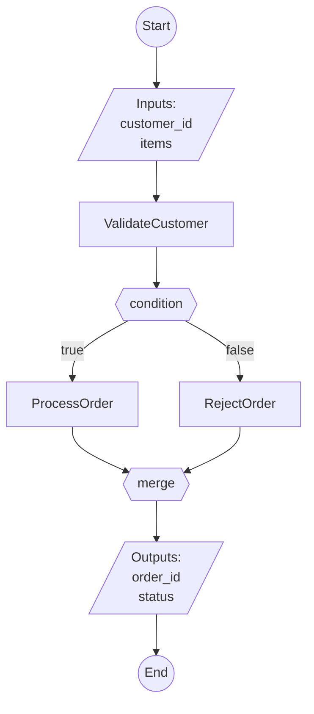

# How FlowLang Works: Internal Architecture

A clear, technical explanation of how FlowLang executes workflows.

---

## Overview

FlowLang is a workflow orchestration engine that executes YAML-defined workflows by coordinating three core components:

```
flow.yaml (what to do) → FlowExecutor (orchestration) → flow.py (how to do it)
         ↓                       ↓                              ↓
    Flow Definition         Execution Engine              Task Registry
```

---

## The Three Core Components

### 1. **FlowExecutor** - The Orchestration Engine

**Location:** `src/flowlang/executor.py`

**Responsibility:** Read `flow.yaml` and coordinate the execution of steps

**What it does:**
1. Loads and parses the YAML flow definition
2. Validates the structure (required fields, step types, inputs)
3. Initializes connections (databases, APIs, etc.) if defined
4. Creates a FlowContext to track execution state
5. Executes steps sequentially or in parallel as defined
6. Handles control flow (conditionals, loops, switches, early exits)
7. Manages error handling and retries
8. Collects and returns outputs

**Key methods:**
- `execute_flow()` - Main entry point
- `_execute_steps()` - Sequential step execution
- `_execute_step()` - Dispatch to specific step type handler
- `_execute_task_step()` - Execute a single task
- `_execute_parallel_step()` - Execute multiple steps concurrently
- `_execute_conditional_step()` - Handle if/then/else logic
- `_execute_switch_step()` - Handle multi-way branching
- `_execute_loop_step()` - Handle for_each iterations

### 2. **TaskRegistry** - The Function Lookup Table

**Location:** `src/flowlang/registry.py`

**Responsibility:** Map task names to their Python implementations

**What it does:**
1. Stores a dictionary of `{task_name: function}` pairs
2. Tracks metadata about each task (description, implementation status, async vs sync)
3. Provides `get_task()` to retrieve a task function by name
4. Validates that tasks are implemented (not stubs)
5. Tracks implementation progress (e.g., "15/30 tasks implemented")

**How tasks are registered:**

In `flow.py`, tasks are registered like this:

```python
def create_task_registry():
    registry = TaskRegistry()

    @registry.register('ValidateUser', description='Validate user credentials')
    async def validate_user(username: str, password: str, connection) -> dict:
        # Implementation here
        return {'valid': True, 'user_id': '12345'}

    return registry
```

**Key methods:**
- `register()` - Decorator to register a task function
- `get_task()` - Retrieve a task by name (raises error if not found/implemented)
- `list_tasks()` - Get all registered tasks with metadata
- `get_implementation_status()` - Get progress statistics

### 3. **FlowContext** - The Execution State Manager

**Location:** `src/flowlang/context.py`

**Responsibility:** Track inputs, outputs, and resolve variable references

**What it stores:**
- `inputs` - Dictionary of flow input parameters
- `outputs` - Dictionary mapping `{step_id: result}` for completed steps
- `metadata` - Additional context (e.g., last error info)
- `cancellation_token` - For flow cancellation support
- `connection_manager` - For database/API connections

**What it does:**
1. Stores the result from each step execution
2. Resolves variable references like `${inputs.username}` or `${validate.user_id}`
3. Supports nested field access like `${step.output.data.name}`
4. Handles string interpolation like `"Hello ${inputs.name}!"`
5. Provides connection access for tasks that need external services

**Key methods:**
- `set_step_output()` - Store a step's result
- `get_step_output()` - Retrieve a step's result
- `resolve_value()` - Recursively resolve variables in values
- `get_connection()` - Get a database/API connection for a task

---

## Execution Flow: Step by Step

Here's exactly what happens when you execute a flow:

### 1. **Server Initialization** (if using REST API)

```python
# FlowServer loads both files at startup
server = FlowServer(project_dir='./my_project')
```

**What happens:**
- `_load_flow()` reads `flow.yaml` and parses it into a Python dict
- `_load_tasks()` imports `flow.py` and calls `create_task_registry()`
- A `FlowExecutor` is created with the task registry
- FastAPI routes are registered

### 2. **Flow Execution Request**

```python
# User sends execution request via API
POST /flows/MyFlow/execute
{
  "inputs": {
    "username": "alice",
    "order_id": "12345"
  }
}
```

**Or programmatically:**

```python
result = await executor.execute_flow(flow_yaml, inputs={'username': 'alice'})
```

### 3. **Executor Parses Flow Definition**

```python
# Inside FlowExecutor.execute_flow()
flow_def = yaml.safe_load(flow_yaml)  # Parse YAML to dict
```

**Structure example:**
```python
{
  'flow': 'OrderProcessor',
  'description': 'Process customer orders',
  'inputs': [{'name': 'order_id', 'type': 'string', 'required': True}],
  'steps': [
    {'task': 'ValidateOrder', 'id': 'validate', 'inputs': {'order_id': '${inputs.order_id}'}},
    {'task': 'ProcessPayment', 'id': 'payment', 'inputs': {'order': '${validate.output}'}}
  ],
  'outputs': [{'name': 'result', 'value': '${payment.output}'}]
}
```

### 4. **Context Initialization**

```python
# Create execution context with inputs
context = FlowContext(inputs={'order_id': '12345'})
```

**Context state:**
```python
{
  'inputs': {'order_id': '12345'},
  'outputs': {},  # Will be populated as steps complete
  'metadata': {}
}
```

### 5. **Step-by-Step Execution**

For each step in `flow_def['steps']`:

#### A. **Resolve Input Variables**

```python
# Step definition
step = {'task': 'ValidateOrder', 'id': 'validate', 'inputs': {'order_id': '${inputs.order_id}'}}

# Executor resolves variables
task_inputs = context.resolve_value(step['inputs'])
# Result: {'order_id': '12345'}
```

#### B. **Lookup Task Function**

```python
# Executor asks registry for the task
task_func = registry.get_task('ValidateOrder')
```

**Registry lookup:**
1. Check if 'ValidateOrder' exists in `_tasks` dict
2. Check if it's implemented (not a stub)
3. Return the actual Python function

#### C. **Handle Connection (if needed)**

```python
# If task signature has 'connection' parameter
sig = inspect.signature(task_func)
if 'connection' in sig.parameters:
    connection_name = step.get('connection')  # e.g., 'postgres'
    connection = await context.get_connection(connection_name)
    task_inputs['connection'] = connection
```

#### D. **Execute Task Function**

```python
# Call the actual Python function from flow.py
if inspect.iscoroutinefunction(task_func):
    result = await task_func(**task_inputs)  # Async call
else:
    result = task_func(**task_inputs)  # Sync call
```

**Example execution:**
```python
# This is the actual function defined in flow.py
async def validate_order(order_id: str, connection) -> dict:
    # Your implementation logic
    return {'valid': True, 'amount': 99.99}
```

#### E. **Store Result in Context**

```python
# Save result for future steps to reference
context.set_step_output('validate', {'valid': True, 'amount': 99.99})
```

**Updated context:**
```python
{
  'inputs': {'order_id': '12345'},
  'outputs': {
    'validate': {'valid': True, 'amount': 99.99}
  }
}
```

### 6. **Next Step Uses Previous Output**

```python
# Step 2 definition
step = {'task': 'ProcessPayment', 'id': 'payment', 'inputs': {'order': '${validate.output}'}}

# Executor resolves variable
task_inputs = context.resolve_value({'order': '${validate.output}'})
# Result: {'order': {'valid': True, 'amount': 99.99}}

# Execute
task_func = registry.get_task('ProcessPayment')
result = await task_func(**task_inputs)
# Result: {'transaction_id': 'txn_789', 'status': 'success'}

# Store
context.set_step_output('payment', result)
```

### 7. **Collect Flow Outputs**

```python
# After all steps complete, collect outputs
outputs = {}
for output_def in flow_def['outputs']:
    name = output_def['name']  # 'result'
    source = output_def['value']  # '${payment.output}'
    outputs[name] = context.resolve_value(source)
    # outputs['result'] = {'transaction_id': 'txn_789', 'status': 'success'}
```

### 8. **Return Result**

```python
return {
    'success': True,
    'outputs': {'result': {'transaction_id': 'txn_789', 'status': 'success'}}
}
```

---

## Special Step Types

### Parallel Execution

```yaml
- parallel:
    - task: FetchUser
      id: user
    - task: FetchOrders
      id: orders
```

**How it works:**
```python
async def _execute_parallel_step(step, context):
    parallel_steps = step['parallel']

    # Create async tasks for all steps
    tasks = [self._execute_step(s, context) for s in parallel_steps]

    # Execute all concurrently with asyncio.gather
    await asyncio.gather(*tasks)
    # Both FetchUser and FetchOrders run at the same time
```

### Conditional Execution

```yaml
- if: "${user.premium} == true"
  then:
    - task: ApplyDiscount
  else:
    - task: ApplyStandardPricing
```

**How it works:**
```python
async def _execute_conditional_step(step, context):
    condition = step['if']  # "${user.premium} == true"

    # Resolve and evaluate condition
    resolved = context.resolve_value("${user.premium}")  # Gets True from context
    condition_result = self._evaluate_condition(condition, context)
    # Parses "== true" and compares: True == True → True

    if condition_result:
        await self._execute_steps(step['then'], context)  # Execute ApplyDiscount
    else:
        await self._execute_steps(step['else'], context)  # Skip
```

### Loops

```yaml
- for_each: ${inputs.items}
  as: item
  do:
    - task: ProcessItem
      inputs:
        item: ${item}
```

**How it works:**
```python
async def _execute_loop_step(step, context):
    items = context.resolve_value('${inputs.items}')  # [1, 2, 3]
    loop_steps = step['do']
    item_var = step.get('as', 'item')  # 'item'

    for item in items:  # Loop 3 times
        # Temporarily add loop variable to context
        context.inputs['item'] = item  # 1, then 2, then 3

        # Execute steps with this item
        await self._execute_steps(loop_steps, context)
        # ProcessItem can access ${item} which resolves to current iteration value
```

---

## Connection Handling

When a task needs to access a database or API:

### 1. **Connection Defined in flow.yaml**

```yaml
connections:
  postgres:
    type: postgres
    url: ${env.DATABASE_URL}

  airtable:
    type: airtable
    api_key: ${env.AIRTABLE_API_KEY}
    base_id: ${env.AIRTABLE_BASE_ID}
```

### 2. **Connection Initialized at Flow Start**

```python
# In FlowExecutor.execute_flow()
if 'connections' in flow_def:
    connection_manager = ConnectionManager(flow_def['connections'])
    await connection_manager.initialize()
    # Creates connection pools, validates credentials, etc.
```

### 3. **Task Requests Connection**

```yaml
- task: FetchUserData
  id: fetch
  connection: postgres  # ← Specifies which connection to use
  inputs:
    user_id: ${inputs.user_id}
```

### 4. **Executor Injects Connection**

```python
# In _execute_task_step()
task_func = registry.get_task('FetchUserData')
sig = inspect.signature(task_func)

if 'connection' in sig.parameters:  # Function accepts connection
    connection_name = step.get('connection')  # 'postgres'
    connection = await context.get_connection(connection_name)
    task_inputs['connection'] = connection  # Add to function arguments
```

### 5. **Task Uses Connection**

```python
# In flow.py
@registry.register('FetchUserData')
async def fetch_user_data(user_id: str, connection) -> dict:
    # connection is a database connection object
    result = await connection.execute("SELECT * FROM users WHERE id = $1", user_id)
    return {'user': result}
```

---

## Error Handling and Retries

### Retry Configuration

```yaml
- task: CallExternalAPI
  id: api_call
  retry:
    max_attempts: 3
    backoff: 1  # seconds
  on_error:
    - task: LogError
      inputs:
        error: ${last_error}
```

### How It Works

```python
async def _execute_task_step(step, context):
    retry_config = step.get('retry', {})
    max_attempts = retry_config.get('max_attempts', 1)  # 3
    backoff = retry_config.get('backoff', 1)  # 1 second

    for attempt in range(max_attempts):  # Try 3 times
        try:
            task_func = registry.get_task('CallExternalAPI')
            result = await task_func(**task_inputs)
            return  # Success - exit retry loop

        except Exception as e:
            if attempt < max_attempts - 1:  # Not last attempt
                wait_time = backoff * (2 ** attempt)  # Exponential backoff: 1s, 2s, 4s
                await asyncio.sleep(wait_time)
            else:  # Last attempt failed
                if 'on_error' in step:
                    # Store error info
                    context.metadata['last_error'] = {'type': type(e).__name__, 'message': str(e)}
                    # Execute error handler steps
                    await self._execute_error_handler(step['on_error'], context, e)
                else:
                    raise  # Re-raise error if no handler
```

---

## Variable Resolution Deep Dive

### How `${...}` References Work

**FlowContext._resolve_string():**

```python
# Input: "User ${inputs.username} ordered ${order.items}"
# Context: inputs={'username': 'alice'}, outputs={'order': {'items': 3}}

text = "User ${inputs.username} ordered ${order.items}"

# 1. Find all ${...} patterns
matches = re.finditer(r'\${([^}]+)}', text)
# Found: ['inputs.username', 'order.items']

# 2. For each match, resolve the path
for match in matches:
    var_path = match.group(1)  # 'inputs.username'
    value = self._resolve_variable_path(var_path)  # 'alice'
    # Replace in string
    text = text.replace('${inputs.username}', 'alice')

# Result: "User alice ordered 3"
```

**FlowContext._resolve_variable_path():**

```python
# Input: 'order.items'
# Context: outputs={'order': {'items': 3, 'status': 'pending'}}

var_path = 'order.items'
parts = var_path.split('.')  # ['order', 'items']

# Get root
if parts[0] == 'inputs':
    current = self.inputs
elif parts[0] in self.outputs:  # 'order' is in outputs
    current = self.outputs[parts[0]]  # {'items': 3, 'status': 'pending'}
    parts = parts[1:]  # Remove 'order', leaving ['items']

# Navigate nested path
for part in parts:  # 'items'
    current = current[part]  # current = 3

return current  # 3
```

---

## Server Layer (REST API)

### FlowServer Architecture

**Location:** `src/flowlang/server.py`

**Initialization:**

```python
server = FlowServer(project_dir='./my_project')
```

**What happens:**

1. **Load flow.yaml:**
   ```python
   with open('my_project/flow.yaml') as f:
       flow_yaml = f.read()
   flow_def = yaml.safe_load(flow_yaml)
   ```

2. **Import flow.py:**
   ```python
   spec = importlib.util.spec_from_file_location("tasks", "my_project/flow.py")
   tasks_module = importlib.util.module_from_spec(spec)
   spec.loader.exec_module(tasks_module)
   registry = tasks_module.create_task_registry()
   ```

3. **Create executor:**
   ```python
   executor = FlowExecutor(registry)
   ```

4. **Register API endpoints:**
   ```python
   @app.post("/flows/{flow_name}/execute")
   async def execute_flow(flow_name: str, request: FlowExecuteRequest):
       result = await executor.execute_flow(flow_yaml, inputs=request.inputs)
       return result
   ```

### Hot Reload (Development)

When you change `flow.py` or `flow.yaml`:

```python
# FileWatcher detects change
def on_tasks_change(file_path):
    # Reload the module
    importlib.reload(tasks_module)

    # Recreate registry
    new_registry = tasks_module.create_task_registry()

    # Replace old registry
    server.registry = new_registry
    server.executor.registry = new_registry

    # No server restart needed!
```

---

## Summary: The Complete Picture

```
┌─────────────────────────────────────────────────────────────────┐
│ 1. User sends API request                                       │
│    POST /flows/OrderProcessor/execute                           │
│    {"inputs": {"order_id": "12345"}}                           │
└───────────────────────────┬─────────────────────────────────────┘
                            ↓
┌─────────────────────────────────────────────────────────────────┐
│ 2. FlowServer receives request                                  │
│    - Already loaded flow.yaml (YAML definition)                 │
│    - Already loaded flow.py (task registry)                     │
└───────────────────────────┬─────────────────────────────────────┘
                            ↓
┌─────────────────────────────────────────────────────────────────┐
│ 3. FlowExecutor.execute_flow() is called                        │
│    - Creates FlowContext with inputs                            │
│    - Initializes connections (if any)                           │
└───────────────────────────┬─────────────────────────────────────┘
                            ↓
┌─────────────────────────────────────────────────────────────────┐
│ 4. For each step in flow.yaml:                                  │
│    ┌────────────────────────────────────────────────────┐      │
│    │ a. Resolve input variables from context            │      │
│    │    "${inputs.order_id}" → "12345"                  │      │
│    │                                                     │      │
│    │ b. Get task function from registry                 │      │
│    │    registry.get_task("ValidateOrder")              │      │
│    │                                                     │      │
│    │ c. Get connection (if needed)                      │      │
│    │    connection = context.get_connection("postgres") │      │
│    │                                                     │      │
│    │ d. Call the Python function from flow.py           │      │
│    │    result = await validate_order(...)              │      │
│    │                                                     │      │
│    │ e. Store result in context                         │      │
│    │    context.outputs["validate"] = result            │      │
│    └────────────────────────────────────────────────────┘      │
│                                                                 │
│    Repeat for all steps (sequential or parallel)               │
└───────────────────────────┬─────────────────────────────────────┘
                            ↓
┌─────────────────────────────────────────────────────────────────┐
│ 5. Collect outputs                                              │
│    - Resolve output variable references                         │
│    - Return final result                                        │
└───────────────────────────┬─────────────────────────────────────┘
                            ↓
┌─────────────────────────────────────────────────────────────────┐
│ 6. FlowServer sends HTTP response                               │
│    {                                                            │
│      "success": true,                                           │
│      "outputs": {"result": {...}}                              │
│    }                                                            │
└─────────────────────────────────────────────────────────────────┘
```

---

## Key Takeaways

1. **flow.yaml** defines **what** to do (the workflow structure)
2. **flow.py** defines **how** to do it (the task implementations)
3. **FlowExecutor** orchestrates execution by reading YAML and calling Python functions
4. **TaskRegistry** maps task names (from YAML) to Python functions (from flow.py)
5. **FlowContext** tracks execution state and resolves variable references
6. Tasks are just Python functions - the executor calls them with resolved inputs
7. Connections are injected as function parameters when needed
8. Everything is async for performance and concurrency

The beauty of FlowLang is this clean separation: business logic lives in YAML (easy to modify), technical implementation lives in Python (full programming power), and the executor bridges the two seamlessly.

---

## What Happens When flow.yaml Changes?

### Without Hot Reload (Default)

When you modify `flow.yaml` and the server is running **without hot reload**:

1. **File is saved** - Your editor writes the changes to disk
2. **Server keeps running** - The server continues using the **old** flow definition
3. **Old YAML is still in memory** - `server.flow_yaml` and `server.flow_def` are unchanged
4. **Next execution uses old definition** - API requests still execute the old workflow
5. **Restart required** - You must restart the server to pick up changes

```bash
# Server running without hot reload
python -m flowlang.server ./my_project

# You edit flow.yaml and save...
# Server still uses old version!

# Must restart:
# Ctrl+C to stop
python -m flowlang.server ./my_project  # Restart to load new YAML
```

### With Hot Reload (Development Mode)

When you modify `flow.yaml` with hot reload enabled:

```bash
# Start server with hot reload
python -m flowlang.server ./my_project --reload
```

**What happens automatically:**

#### 1. **File System Event Triggered**
```python
# FileWatcher detects the change (using watchdog library)
# Waits 0.5 seconds (debounce) to avoid duplicate events from multiple saves
```

#### 2. **Reload Manager Validates New YAML**
```python
# ReloadManager.reload_flow_yaml() is called
def reload_flow_yaml():
    # Backup current YAML (for rollback if needed)
    self.previous_flow_yaml = old_yaml

    # Read new file from disk
    with open('flow.yaml', 'r') as f:
        new_yaml = f.read()

    # Validate by parsing
    flow_def = yaml.safe_load(new_yaml)

    # Check required fields
    if 'flow' not in flow_def:
        raise ReloadError("Flow YAML must have a 'flow' field")

    return new_yaml  # Return if valid
```

#### 3. **Server Updates Flow Definition**
```python
# Server's on_flow_change callback updates in-memory data
def on_flow_change(file_path):
    new_yaml = reload_manager.reload_flow_yaml()
    if new_yaml:
        # Update server's flow definition
        server.flow_yaml = new_yaml
        server.flow_def = yaml.safe_load(new_yaml)
        logger.info("✨ Flow definition updated")
```

#### 4. **Next Execution Uses New Definition**

```python
# API endpoint receives request
@app.post("/flows/{flow_name}/execute")
async def execute_flow(request):
    # Executor uses the UPDATED flow YAML
    result = await executor.execute_flow(
        server.flow_yaml,  # ← This is now the new YAML!
        inputs=request.inputs
    )
```

**The executor parses it fresh every time:**
```python
# In FlowExecutor.execute_flow()
if isinstance(flow_yaml, str):
    flow_def = yaml.safe_load(flow_yaml)  # ← Parses the NEW YAML string
else:
    flow_def = flow_yaml

# Then executes using new definition
steps = flow_def.get('steps', [])
await self._execute_steps(steps, context)
```

### What Changes Are Detected?

When you modify flow.yaml, the hot reload system picks up ALL changes:

1. **New steps added** → Executor will call new tasks
2. **Steps removed** → Executor skips removed tasks
3. **Step order changed** → Executor runs in new order
4. **Input/output definitions changed** → API schema reflects changes
5. **Control flow changes** (if/else, loops, parallel) → Executor follows new logic
6. **New connections added** → Connection manager initializes them
7. **Description changed** → API docs update

### Example: Adding a New Step

**Original flow.yaml:**
```yaml
flow: OrderProcessor
steps:
  - task: ValidateOrder
    id: validate
  - task: ProcessPayment
    id: payment
```

**You edit and save:**
```yaml
flow: OrderProcessor
steps:
  - task: ValidateOrder
    id: validate
  - task: CheckInventory      # ← NEW STEP
    id: inventory              # ← NEW STEP
  - task: ProcessPayment
    id: payment
```

**What happens with hot reload:**

```
1. FileWatcher detects change → "📝 File changed: flow.yaml"
2. ReloadManager validates new YAML → "✅ Flow YAML reloaded successfully (5ms)"
3. Server updates flow_def → "✨ Flow definition updated"
4. Next API request:
   a. Executor parses NEW YAML
   b. Sees 3 steps instead of 2
   c. Tries to call CheckInventory task
   d. If task exists in registry → executes it
   e. If task doesn't exist → raises TaskNotFoundError
```

### Error Handling During Reload

If the new YAML is invalid:

```python
# You save broken YAML
flow: OrderProcessor
steps
  - task: ValidateOrder  # ← Syntax error (missing colon)

# Hot reload attempts to load it:
# ❌ Flow YAML reload failed: YAMLError: ...
# ↩️  Keeping previous flow definition active

# Server continues using OLD YAML - no downtime!
```

**The reload system protects you:**
- Invalid YAML → Error logged, old version kept
- Missing required fields → Error logged, rollback
- Parse errors → Old version stays active

### Hot Reload vs Server Restart

| Aspect | Hot Reload | Server Restart |
|--------|-----------|----------------|
| **Speed** | ~5-50ms | ~1-3 seconds |
| **Downtime** | None - server stays running | Yes - server stops |
| **In-flight requests** | Continue with old version | Terminated |
| **Connection pools** | Preserved | Recreated |
| **Task registry** | Preserved (unless flow.py also changes) | Reloaded |
| **Automatic** | Yes (when enabled) | No (manual) |

### Multi-Flow Server

In multi-flow mode, each flow gets its own file watcher:

```python
# Multi-flow server watches ALL flows
python -m flowlang.server --multi ./flows --reload

# Directory structure:
flows/
├── order_flow/
│   └── flow.yaml  ← Watched independently
├── user_flow/
│   └── flow.yaml  ← Watched independently
└── payment_flow/
    └── flow.yaml  ← Watched independently
```

**When you edit `flows/order_flow/flow.yaml`:**
- Only `order_flow` is reloaded
- `user_flow` and `payment_flow` are unaffected
- Each flow has isolated reload state

```
📝 [OrderFlow] flow.yaml changed
⚡ Reloading flow.yaml...
✅ Flow YAML reloaded successfully (4ms)
   Flow name: OrderFlow
✨ [OrderFlow] Flow definition reloaded

# Other flows continue running unchanged
```

### Limitations of Hot Reload for YAML Changes

**What hot reload CAN do:**
- ✅ Update step definitions
- ✅ Change step order
- ✅ Add/remove steps
- ✅ Modify control flow (if/else, loops)
- ✅ Update input/output definitions
- ✅ Change connection configurations
- ✅ Update descriptions

**What hot reload CANNOT do:**
- ❌ Update FastAPI route definitions (requires restart)
- ❌ Update Pydantic request models dynamically (schema frozen at startup)
- ❌ Change flow name cleanly (URL paths don't update)
- ❌ Update OpenAPI docs structure (generated at startup)

**For these changes, restart the server:**
```bash
# Stop server
Ctrl+C

# Restart
python -m flowlang.server ./my_project --reload
```

### Best Practices

1. **Always use hot reload during development**
   ```bash
   python -m flowlang.server ./my_project --reload
   ```

2. **Test YAML changes before saving**
   - Use `python -m flowlang validate flow.yaml` to check syntax

3. **Add new tasks to flow.py BEFORE referencing in YAML**
   - Hot reload will fail if YAML references non-existent tasks

4. **Watch server logs for reload status**
   - Look for ✅ or ❌ messages after saving

5. **Disable hot reload in production**
   - File watching has overhead
   - Production should use stable, tested definitions
   ```bash
   # Production (no --reload flag)
   python -m flowlang.server ./my_project --port 8000
   ```

### Summary

**flow.yaml changes WITHOUT hot reload:**
- Server keeps using old definition
- Must restart to see changes
- Downtime during restart

**flow.yaml changes WITH hot reload:**
- Server detects change automatically (0.5s debounce)
- Validates new YAML
- Updates in-memory flow definition
- Next execution uses new definition
- No downtime
- Automatic rollback on errors
- Logs show reload status

Hot reload makes iterative flow development fast and safe - you can modify workflows and test immediately without restarting the server.

---

## Flow Visualization

FlowLang includes built-in visualization capabilities that generate interactive diagrams from your flow definitions. This helps you understand workflow structure, debug complex flows, and document your system.

### How Visualization Works

**Location:** `src/flowlang/visualizer.py` (FlowVisualizer class)

**What it does:**
1. Parses flow YAML definition
2. Generates Mermaid diagram syntax (text-based flowchart format)
3. Supports all flow constructs (sequential, parallel, conditional, loops)
4. Can be rendered as JSON (for programmatic use) or HTML (for browser viewing)

### Available Endpoints

Both FlowServer and MultiFlowServer expose visualization endpoints:

#### JSON Format (Default)

Returns Mermaid diagram as JSON - useful for programmatic access or rendering in external tools:

```bash
# Get Mermaid diagram text
GET /flows/{flow_name}/visualize

# Or explicitly request JSON
GET /flows/{flow_name}/visualize?format=json
```

**Response:**
```json
{
  "flow": "OrderProcessor",
  "diagram": "```mermaid\nflowchart TD\n    node0((\"Start\"))\n    ...",
  "format": "mermaid"
}
```

#### HTML Format (New)

Returns a fully-rendered HTML page with interactive Mermaid diagram - open directly in browser:

```bash
# Get rendered HTML page
GET /flows/{flow_name}/visualize?format=html
```

**What you get:**
- Complete HTML page with embedded Mermaid.js library
- Auto-renders diagram on page load
- Styled presentation with gradient background
- Interactive toolbar with features:
  - **Print Diagram** - Browser-based printing
  - **Download SVG** - Export diagram as SVG file
  - **View Mermaid Source** - See the underlying Mermaid syntax
- Mobile-responsive design
- No external dependencies required

### How HTML Visualization Works

#### 1. **Request Arrives**

```python
GET /flows/HelloWorld/visualize?format=html
```

#### 2. **Server Generates Diagram**

```python
# In server.py visualize_flow endpoint
from .visualizer import FlowVisualizer

# Create visualizer with flow definition
visualizer = FlowVisualizer(flow_def)

# Generate Mermaid syntax
diagram = visualizer.generate_mermaid()
# Result: "```mermaid\nflowchart TD\n    node0((\"Start\"))\n    ..."
```

#### 3. **Load HTML Template**

```python
# Read template from src/flowlang/templates/visualize.html
template_path = Path(__file__).parent / "templates" / "visualize.html"
with open(template_path, 'r') as f:
    html_template = f.read()
```

#### 4. **Replace Template Variables**

```python
# Substitute flow name and diagram content
html_content = html_template.replace("{{flow_name}}", "HelloWorld")
html_content = html_content.replace("{{diagram}}", diagram)
```

#### 5. **Return HTML Response**

```python
return HTMLResponse(content=html_content)
```

#### 6. **Browser Renders Diagram**

When the HTML loads in browser:
1. Mermaid.js library loads from CDN
2. Finds `<div class="mermaid">` with diagram syntax
3. Parses Mermaid syntax and generates SVG
4. Renders interactive flowchart
5. User can zoom, pan, print, or download

### Template Structure

The HTML template (`src/flowlang/templates/visualize.html`) includes:

**Components:**
- **Header** - Flow name and subtitle
- **Toolbar** - Action buttons (Print, Download SVG, View Source)
- **Diagram Container** - White card with rendered Mermaid diagram
- **Footer** - FlowLang branding link

**Features:**
- Mermaid.js v10 from CDN (ESM module)
- Auto-initialization on page load
- Responsive CSS with gradient background
- Print-friendly styles
- Download functionality via JavaScript
- Source code viewer (opens in new window)

### Example Usage

#### Via Browser

```
# Start server
python -m flowlang.server ./my_project --reload

# Open in browser
http://localhost:8000/flows/OrderProcessor/visualize?format=html
```

#### Via curl

```bash
# Get JSON (default)
curl http://localhost:8000/flows/OrderProcessor/visualize

# Save HTML to file and open
curl "http://localhost:8000/flows/OrderProcessor/visualize?format=html" > diagram.html
open diagram.html  # macOS
# or
xdg-open diagram.html  # Linux
# or
start diagram.html  # Windows
```

#### Programmatic Access (Python)

```python
import requests

# Get JSON format for processing
response = requests.get(
    'http://localhost:8000/flows/OrderProcessor/visualize',
    params={'format': 'json'}
)
diagram_data = response.json()
mermaid_text = diagram_data['diagram']

# Or get HTML for saving/display
response = requests.get(
    'http://localhost:8000/flows/OrderProcessor/visualize',
    params={'format': 'html'}
)
html_content = response.text
with open('flow_diagram.html', 'w') as f:
    f.write(html_content)
```

### What Gets Visualized

The FlowVisualizer generates diagrams showing:

1. **Flow Inputs** - Parallelogram shape with input parameter names
2. **Task Steps** - Rectangles with task names
3. **Parallel Execution** - Fork/join diamonds showing concurrent branches
4. **Conditional Branches** - Decision diamonds with true/false paths
5. **Loops** - for_each constructs with back edges
6. **Flow Outputs** - Parallelogram shape with output names
7. **Start/End Nodes** - Circle shapes marking flow boundaries

**Example Visualization:**



### Use Cases

**During Development:**
- Understand flow structure at a glance
- Debug complex conditional logic
- Verify parallel execution paths
- Document workflow behavior

**In Documentation:**
- Embed diagrams in README files (save SVG)
- Include in API documentation
- Share with stakeholders
- Create architecture diagrams

**For Debugging:**
- Visualize execution path
- Identify bottlenecks in parallel flows
- Verify conditional branching logic
- Understand loop iterations

### Multi-Flow Server

In multi-flow mode, each flow has its own visualization endpoint:

```bash
# List all flows
GET /flows
# Response: [{"name": "OrderFlow", ...}, {"name": "UserFlow", ...}]

# Visualize specific flow
GET /flows/OrderFlow/visualize?format=html
GET /flows/UserFlow/visualize?format=html
```

### Limitations

**What works:**
- ✅ All step types (task, parallel, conditional, switch, loop, exit)
- ✅ Sequential and parallel execution paths
- ✅ Nested conditions and loops
- ✅ Connection references
- ✅ Input/output visualization

**Current limitations:**
- ⚠️ Very large flows (100+ steps) may be hard to read
- ⚠️ Deeply nested structures can become complex
- ⚠️ Dynamic loop iterations not shown (just loop structure)
- ⚠️ Variable references not expanded in diagram

**Tip:** For large flows, consider breaking them into smaller subflows for clearer visualization.

### Customization

The HTML template uses inline CSS for portability. To customize:

1. **Edit template:** `src/flowlang/templates/visualize.html`
2. **Modify Mermaid theme:**
   ```javascript
   mermaid.initialize({
       theme: 'dark',  // or 'default', 'forest', 'neutral'
       // ... other options
   });
   ```
3. **Update CSS:** Modify styles in `<style>` block
4. **Add features:** Extend JavaScript in `<script>` block

### Summary

Flow visualization provides instant visual feedback on your workflow structure:

- **JSON endpoint** (`?format=json`) - For programmatic access, CI/CD, external tools
- **HTML endpoint** (`?format=html`) - For direct browser viewing, documentation, sharing
- **Zero configuration** - Works out of the box with any flow
- **Interactive features** - Print, download, view source
- **Backward compatible** - JSON format remains the default

Access visualizations via: `GET /flows/{flow_name}/visualize?format=html`
