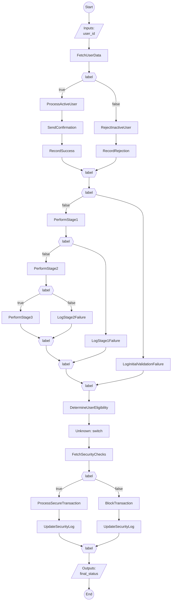

# EarlyTerminationPatterns - Implementation Guide

Auto-generated by FlowLang Scaffolder on 2025-10-11 16:28:35

## Overview

This project contains a flow definition and scaffolded task implementations. All tasks are currently **stubs** that need to be implemented.

## Flow Visualization



## Project Structure

```
.
├── flow.yaml           # Flow definition (copy from source YAML)
├── flow.py             # Task implementations (TODO: implement these)
├── api.py              # FastAPI app export
├── README.md           # This file
├── tools/              # Scripts and utilities
│   └── start_server.sh # Start API server
└── tests/              # Test files
    └── test_tasks.py   # Unit tests for tasks
```

**Note**: This project was generated from a source YAML template. To regenerate or update:
- Edit the source YAML file (e.g., `flows/your_flow.yaml`)
- Run: `python -m flowlang.scaffolder auto flows/your_flow.yaml`
- Or from project root: `./generate_flows.sh` (processes all flows)

## Implementation Status

- **Total tasks**: 26
- **Implemented**: 0
- **Pending**: 26
- **Progress**: 0/26 (0.0%)

## Quick Start

### 1. Check Current Status

```bash
python flow.py
```

This shows which tasks are pending implementation.

### 2. Implement Tasks One by One

Each task in `flow.py` currently raises `NotImplementedTaskError`. Implement them incrementally:

```python
@registry.register('TaskName')
async def task_name(param1, param2):
    # Remove this line:
    # raise NotImplementedTaskError("TaskName")

    # Add your implementation:
    result = do_something(param1, param2)

    return {
        'output_key': result
    }
```

### 3. Update Implementation Status

After implementing a task, update `get_implementation_status()` in `flow.py`:

```python
def get_implementation_status() -> Dict[str, Any]:
    tasks = {
        'TaskName': True,  # ← Changed from False to True
        ...
    }
```

### 4. Run Tests

```bash
# Run all tests
pytest tests/test_tasks.py -v

# Run specific test
pytest tests/test_tasks.py::test_task_name -v
```

Update tests to verify actual behavior instead of expecting `NotImplementedTaskError`.

### 5. Run the Complete Flow

Once all tasks are implemented:

```python
import asyncio
from flowlang import FlowExecutor
from flow import create_task_registry

async def main():
    # Load flow
    with open('flow.yaml') as f:
        flow_yaml = f.read()

    # Create executor
    registry = create_task_registry()
    executor = FlowExecutor(registry)

    # Execute flow
    result = await executor.execute_flow(
        flow_yaml,
        inputs={
            # Your flow inputs here
        }
    )

    print(f"Success: {result['success']}")
    print(f"Outputs: {result['outputs']}")

if __name__ == '__main__':
    asyncio.run(main())
```

## Task List


### 1. BlockTransaction

- **Status**: ⚠️ Not implemented
- **Function**: `block_transaction`
- **Used in**: blocked
- **Inputs**: `security, user_id`


### 2. DetermineUserEligibility

- **Status**: ⚠️ Not implemented
- **Function**: `determine_user_eligibility`
- **Used in**: eligibility
- **Inputs**: `user_id`


### 3. FetchSecurityChecks

- **Status**: ⚠️ Not implemented
- **Function**: `fetch_security_checks`
- **Used in**: security
- **Inputs**: `user_id`


### 4. FetchUserData

- **Status**: ⚠️ Not implemented
- **Function**: `fetch_user_data`
- **Used in**: user
- **Inputs**: `user_id`


### 5. LogInitialValidationFailure

- **Status**: ⚠️ Not implemented
- **Function**: `log_initial_validation_failure`
- **Used in**: validation_fail
- **Inputs**: `user_id`


### 6. LogRejection

- **Status**: ⚠️ Not implemented
- **Function**: `log_rejection`
- **Used in**: log_reject
- **Inputs**: `user_id`


### 7. LogSecurityBlock

- **Status**: ⚠️ Not implemented
- **Function**: `log_security_block`
- **Used in**: log_block
- **Inputs**: `user_id`


### 8. LogStage1Failure

- **Status**: ⚠️ Not implemented
- **Function**: `log_stage1_failure`
- **Used in**: stage1_fail
- **Inputs**: `user_id`


### 9. LogStage2Failure

- **Status**: ⚠️ Not implemented
- **Function**: `log_stage2_failure`
- **Used in**: stage2_fail
- **Inputs**: `user_id`


### 10. LogUnknownStatus

- **Status**: ⚠️ Not implemented
- **Function**: `log_unknown_status`
- **Used in**: log_unknown
- **Inputs**: `user_id`


### 11. NotifySecurityTeam

- **Status**: ⚠️ Not implemented
- **Function**: `notify_security_team`
- **Used in**: notify_security
- **Inputs**: `user_id`


### 12. PerformStage1

- **Status**: ⚠️ Not implemented
- **Function**: `perform_stage1`
- **Used in**: stage1
- **Inputs**: `user_id`


### 13. PerformStage2

- **Status**: ⚠️ Not implemented
- **Function**: `perform_stage2`
- **Used in**: stage2
- **Inputs**: `stage1_data, user_id`


### 14. PerformStage3

- **Status**: ⚠️ Not implemented
- **Function**: `perform_stage3`
- **Used in**: stage3
- **Inputs**: `stage2_data, user_id`


### 15. ProcessActiveUser

- **Status**: ⚠️ Not implemented
- **Function**: `process_active_user`
- **Used in**: process_result
- **Inputs**: `user_id`


### 16. ProcessApproval

- **Status**: ⚠️ Not implemented
- **Function**: `process_approval`
- **Used in**: approval_result
- **Inputs**: `user_id`


### 17. ProcessSecureTransaction

- **Status**: ⚠️ Not implemented
- **Function**: `process_secure_transaction`
- **Used in**: secure_process
- **Inputs**: `user_id`


### 18. QueueForReview

- **Status**: ⚠️ Not implemented
- **Function**: `queue_for_review`
- **Used in**: review_queued
- **Inputs**: `user_id`


### 19. RecordRejection

- **Status**: ⚠️ Not implemented
- **Function**: `record_rejection`
- **Used in**: final_result
- **Inputs**: `outcome, user_id`


### 20. RecordSuccess

- **Status**: ⚠️ Not implemented
- **Function**: `record_success`
- **Used in**: final_result
- **Inputs**: `outcome, user_id`


### 21. RejectInactiveUser

- **Status**: ⚠️ Not implemented
- **Function**: `reject_inactive_user`
- **Used in**: rejection
- **Inputs**: `user_id`


### 22. SendApprovalNotification

- **Status**: ⚠️ Not implemented
- **Function**: `send_approval_notification`
- **Used in**: notify_approved
- **Inputs**: `user_id`


### 23. SendConfirmation

- **Status**: ⚠️ Not implemented
- **Function**: `send_confirmation`
- **Used in**: confirmation
- **Inputs**: `user_id`


### 24. SendPendingNotification

- **Status**: ⚠️ Not implemented
- **Function**: `send_pending_notification`
- **Used in**: notify_pending
- **Inputs**: `user_id`


### 25. SendRejectionNotification

- **Status**: ⚠️ Not implemented
- **Function**: `send_rejection_notification`
- **Used in**: notify_rejected
- **Inputs**: `user_id`


### 26. UpdateSecurityLog

- **Status**: ⚠️ Not implemented
- **Function**: `update_security_log`
- **Used in**: security_log_success, security_log_blocked
- **Inputs**: `result, user_id`


## Development Tips

1. **Start with simple tasks** - Implement logging, validation tasks first
2. **Use TDD approach** - Write/update tests as you implement
3. **Check progress frequently** - Run `python flow.py` to see status
4. **Test incrementally** - Test each task as you complete it
5. **Mock external dependencies** - Use mock data initially, integrate real APIs later

## Testing Strategy

- **Unit tests**: Test each task in isolation (test_tasks.py)
- **Integration tests**: Test the complete flow execution
- **Use fixtures**: Create reusable test data
- **Mock external calls**: Don't depend on external services in tests

## Next Steps

- [ ] Implement all task stubs
- [ ] Write comprehensive tests
- [ ] Integrate with external APIs/databases
- [ ] Add error handling and retries
- [ ] Add logging and monitoring
- [ ] Deploy to production

## Getting Help

- FlowLang documentation: See CLAUDE.md
- Flow syntax: Check flow.yaml for examples
- Task registry: See src/flowlang/registry.py

Good luck! 🚀
