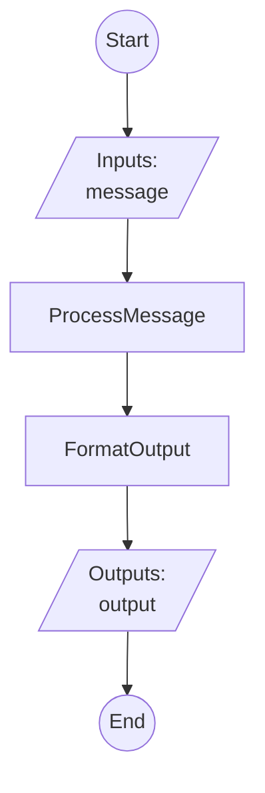

# TestFlow - Implementation Guide

Auto-generated by FlowLang Scaffolder on 2025-10-11 13:07:16

## Overview

This project contains a flow definition and scaffolded task implementations. All tasks are currently **stubs** that need to be implemented.

## Flow Visualization



## Project Structure

```
.
├── flow.yaml           # Flow definition (copy from source YAML)
├── flow.py             # Task implementations (TODO: implement these)
├── api.py              # FastAPI app export
├── README.md           # This file
├── tools/              # Scripts and utilities
│   └── start_server.sh # Start API server
└── tests/              # Test files
    └── test_tasks.py   # Unit tests for tasks
```

**Note**: This project was generated from a source YAML template. To regenerate or update:
- Edit the source YAML file (e.g., `flows/your_flow.yaml`)
- Run: `python -m flowlang.scaffolder auto flows/your_flow.yaml`
- Or from project root: `./generate_flows.sh` (processes all flows)

## Implementation Status

- **Total tasks**: 2
- **Implemented**: 0
- **Pending**: 2
- **Progress**: 0/2 (0.0%)

## Quick Start

### 1. Check Current Status

```bash
python flow.py
```

This shows which tasks are pending implementation.

### 2. Implement Tasks One by One

Each task in `flow.py` currently raises `NotImplementedTaskError`. Implement them incrementally:

```python
@registry.register('TaskName')
async def task_name(param1, param2):
    # Remove this line:
    # raise NotImplementedTaskError("TaskName")

    # Add your implementation:
    result = do_something(param1, param2)

    return {
        'output_key': result
    }
```

### 3. Update Implementation Status

After implementing a task, update `get_implementation_status()` in `flow.py`:

```python
def get_implementation_status() -> Dict[str, Any]:
    tasks = {
        'TaskName': True,  # ← Changed from False to True
        ...
    }
```

### 4. Run Tests

```bash
# Run all tests
pytest tests/test_tasks.py -v

# Run specific test
pytest tests/test_tasks.py::test_task_name -v
```

Update tests to verify actual behavior instead of expecting `NotImplementedTaskError`.

### 5. Run the Complete Flow

Once all tasks are implemented:

```python
import asyncio
from flowlang import FlowExecutor
from flow import create_task_registry

async def main():
    # Load flow
    with open('flow.yaml') as f:
        flow_yaml = f.read()

    # Create executor
    registry = create_task_registry()
    executor = FlowExecutor(registry)

    # Execute flow
    result = await executor.execute_flow(
        flow_yaml,
        inputs={
            # Your flow inputs here
        }
    )

    print(f"Success: {result['success']}")
    print(f"Outputs: {result['outputs']}")

if __name__ == '__main__':
    asyncio.run(main())
```

## Task List


### 1. FormatOutput

- **Status**: ⚠️ Not implemented
- **Function**: `format_output`
- **Used in**: format
- **Inputs**: `data`


### 2. ProcessMessage

- **Status**: ⚠️ Not implemented
- **Function**: `process_message`
- **Used in**: process
- **Inputs**: `text`


## Development Tips

1. **Start with simple tasks** - Implement logging, validation tasks first
2. **Use TDD approach** - Write/update tests as you implement
3. **Check progress frequently** - Run `python flow.py` to see status
4. **Test incrementally** - Test each task as you complete it
5. **Mock external dependencies** - Use mock data initially, integrate real APIs later

## Testing Strategy

- **Unit tests**: Test each task in isolation (test_tasks.py)
- **Integration tests**: Test the complete flow execution
- **Use fixtures**: Create reusable test data
- **Mock external calls**: Don't depend on external services in tests

## Next Steps

- [ ] Implement all task stubs
- [ ] Write comprehensive tests
- [ ] Integrate with external APIs/databases
- [ ] Add error handling and retries
- [ ] Add logging and monitoring
- [ ] Deploy to production

## Getting Help

- FlowLang documentation: See CLAUDE.md
- Flow syntax: Check flow.yaml for examples
- Task registry: See src/flowlang/registry.py

Good luck! 🚀
